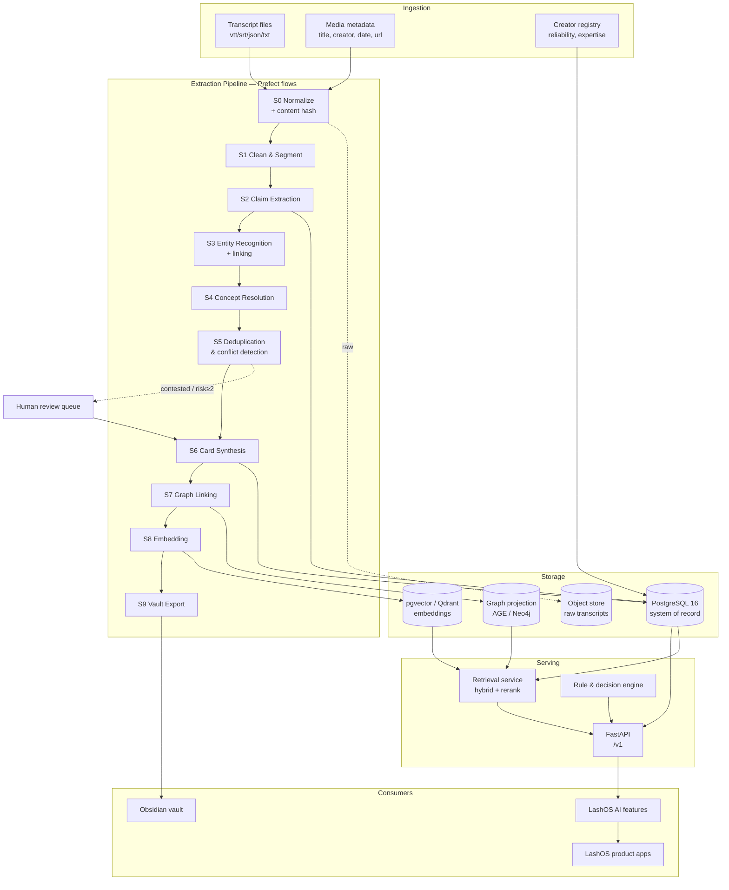

# 00 — System Architecture

## 1. Design principles

These are the constraints every downstream decision is measured against.

| # | Principle | Consequence |
| --- | --- | --- |
| P1 | **Evidence is immutable, knowledge is derived.** | Claims are append-only. Cards are regenerated. Nothing that came from a human's mouth is ever edited or deleted. |
| P2 | **Provenance is unbreakable.** | Every rendered sentence traces to `card → claim → chunk → source → timestamp`. If the chain breaks, the assertion is dropped, not published. |
| P3 | **The database is the truth; every other surface is a projection.** | Obsidian, the vector store, the graph store, and the API all render from Postgres. Any of them can be destroyed and rebuilt. |
| P4 | **Disagreement is preserved, never resolved by averaging.** | Contradiction is a first-class entity with its own lifecycle. |
| P5 | **Knowledge is parametric where possible.** | Typed, unit-bearing values enable computation, not just retrieval. |
| P6 | **Confidence gates capability.** | Low-confidence knowledge can be *shown* but never *acted upon* by an AI feature. Risk tier overrides confidence. |
| P7 | **Every stage is idempotent and content-addressed.** | Re-running the pipeline on 4,000 transcripts must not create 8,000 cards. |
| P8 | **Cheap models do bulk work; expensive models do judgment.** | Cost scales sub-linearly with corpus size. |
| P9 | **Humans review the top of the risk pyramid only.** | Human attention is the scarcest resource; spend it on safety-tier and contested knowledge. |
| P10 | **Schema-first.** | Every object has a JSON Schema. LLM outputs are validated against it before they touch the database. |

---

## 2. The layer cake

```
┌───────────────────────────────────────────────────────────────────────────┐
│  L7  PRODUCT LAYER                                                        │
│      AI Educator · Consultation · Retention Expert · Styling · Products   │
│      Troubleshooting · Business Coach · Course Generator · Certification   │
├───────────────────────────────────────────────────────────────────────────┤
│  L6  REASONING LAYER                                                      │
│      Decision models · Diagnostic trees · Rule engine · Prediction        │
│      features · Safety gates · Persona/prompt assets · Eval harness       │
├───────────────────────────────────────────────────────────────────────────┤
│  L5  RETRIEVAL LAYER                                                      │
│      Hybrid search (BM25 + dense + graph expansion + rerank)              │
│      Card index · Claim index · Quote index · Metadata prefilters         │
├───────────────────────────────────────────────────────────────────────────┤
│  L4  KNOWLEDGE LAYER                                                      │
│      Knowledge Cards · Entities · Relations · Contradictions · Parameters │
│      Confidence · Epistemic status · Risk tier · Versions                 │
├───────────────────────────────────────────────────────────────────────────┤
│  L3  EVIDENCE LAYER                                                       │
│      Claims (atomic, source-anchored, immutable)                          │
├───────────────────────────────────────────────────────────────────────────┤
│  L2  SEGMENT LAYER                                                        │
│      Cleaned, speaker-attributed, timestamped chunks                      │
├───────────────────────────────────────────────────────────────────────────┤
│  L1  SOURCE LAYER                                                         │
│      Raw transcripts · media metadata · creator profiles · reliability    │
└───────────────────────────────────────────────────────────────────────────┘
```

Each layer only reads from the layer below it. No layer skips. This is what makes the
provenance chain in P2 structurally guaranteed rather than merely intended.

---

## 3. Component architecture



---

## 4. The two folder trees

A recurring source of confusion in knowledge systems is conflating the **code repository**
with the **knowledge vault**. They are separate trees with separate lifecycles.

### 4.1 Repository tree (version-controlled, human-authored)

```
lashos-knowledge-engine/
├── README.md
├── pyproject.toml
├── docs/                              # architecture (this directory)
│   ├── 00-system-architecture.md
│   ├── 01-master-taxonomy.md
│   ├── 02-data-model.md
│   ├── 03-extraction-pipeline.md
│   ├── 04-knowledge-graph.md
│   ├── 05-deduplication.md
│   ├── 06-confidence-and-evidence.md
│   ├── 07-rag-architecture.md
│   ├── 08-obsidian-vault.md
│   ├── 09-database-schema.md
│   ├── 10-api-architecture.md
│   ├── 11-technology-stack.md
│   └── 12-implementation-plan.md
├── schemas/
│   ├── json/                          # JSON Schema 2020-12 contracts
│   │   ├── source.schema.json
│   │   ├── chunk.schema.json
│   │   ├── claim.schema.json
│   │   ├── knowledge_card.schema.json
│   │   ├── entity.schema.json
│   │   ├── relation.schema.json
│   │   ├── contradiction.schema.json
│   │   ├── parameter.schema.json
│   │   └── extraction_output.schema.json
│   └── yaml/
│       └── frontmatter.spec.yaml      # Obsidian YAML contract
├── taxonomy/
│   ├── taxonomy.yaml                  # the 17-domain master tree
│   ├── facets.yaml                    # orthogonal classification axes
│   ├── entity_types.yaml
│   ├── relation_types.yaml
│   └── controlled_vocabularies.yaml   # curls, diameters, styles, units
├── templates/obsidian/                # rendered-output templates
├── db/migrations/                     # SQL migrations
├── src/lashos_ke/                     # Python package
├── tests/
├── examples/                          # worked end-to-end example
└── data/                              # gitignored working storage
    ├── raw/                           # original transcripts
    ├── interim/                       # cleaned + segmented
    └── processed/                     # extraction artifacts
```

### 4.2 Vault tree (generated, regenerable, human-readable)

```
vault/
├── 00-System/                    # vault README, changelog, schema reference, dashboards
├── 10-Knowledge/                 # knowledge cards — one file per concept
│   ├── 01-Anatomy-Biology/
│   ├── 02-Lash-Health-Safety/
│   ├── 03-Natural-Lash-Assessment/
│   ├── 04-Styling-Design/
│   ├── 05-Lash-Mapping/
│   ├── 06-Retention-Science/
│   ├── 07-Adhesive-Science/
│   ├── 08-Application-Technique/
│   ├── 09-Products-Materials/
│   ├── 10-Adjacent-Services/
│   ├── 11-Consultation-Client-Experience/
│   ├── 12-Client-Psychology/
│   ├── 13-Business-Operations/
│   ├── 14-Marketing-Brand/
│   ├── 15-Education-Pedagogy/
│   ├── 16-Industry-Intelligence/
│   └── 17-LashOS-Intelligence/
├── 20-Entities/                  # the things cards talk about
│   ├── Brands/  Products/  Chemicals/  Tools/  Conditions/
│   ├── Styles/  EyeShapes/  Curls/  People/  Organizations/  Regions/
├── 30-Sources/                   # one note per transcript (metadata + claim index, NOT the text)
├── 40-Maps/                      # MOCs, domain hubs, .canvas files
├── 50-Contradictions/            # open disputes, one file per contradiction
├── 60-Playbooks/                 # derived assets: SOPs, diagnostic trees, decision matrices
├── 70-Research/                  # open questions, evidence gaps, myth registry
├── 90-Attachments/
└── _templates/                   # Templater templates for manual authoring
```

**Raw transcripts never enter the vault.** They would flood graph view, poison search,
and destroy the signal-to-noise ratio that makes the vault useful. Source notes in
`30-Sources/` carry metadata and a link index into the claims — the text itself stays in
object storage, addressable by ID.

---

## 5. Data flow contract between stages

Every stage obeys the same contract:

```
Stage(input_artifact, config) → output_artifact
    where output_artifact.id = hash(stage_version, input_artifact.id, config_hash)
```

Consequences:

- **Idempotent.** Re-running with identical inputs is a no-op; the artifact already exists.
- **Resumable.** A crash at stage 5 of 4,000 transcripts resumes at exactly the failed unit.
- **Auditable.** Every artifact records which prompt version and model produced it.
- **Cheap to reprocess selectively.** Bumping the claim-extraction prompt invalidates S2
  downstream only for affected sources; S0/S1 artifacts are reused.

Stage version is part of the hash, so improving a prompt automatically triggers reprocessing
of exactly the artifacts that depend on it — no manual cache invalidation.

---

## 6. Cost architecture

At 4,000 transcripts averaging 8,000 words, naive "send everything to a frontier model"
processing is both slow and unnecessary. Model assignment by stage:

| Stage | Work | Model class | Rationale |
| --- | --- | --- | --- |
| S1 Clean & segment | Disfluency removal, speaker attribution, topic segmentation | Small/fast | Mechanical, high volume |
| S2 Claim extraction | Assertion identification, hedge detection, scope | **Frontier** | The single highest-leverage judgment in the system |
| S3 Entity recognition | NER + linking to registry | Small + embedding lookup | Constrained output space |
| S4 Concept resolution | Map claim → canonical concept | Embedding + small | Retrieval-shaped, not generative |
| S5 Dedup adjudication | Only for the 0.80–0.93 similarity band | **Frontier** | Genuine ambiguity; ~5% of pairs |
| S6 Card synthesis | Write the card from N claims | **Frontier** | Customer-visible prose quality |
| S7 Graph linking | Relation extraction between concepts | Mid-tier | Constrained predicate vocabulary |
| S8 Embedding | Vectorize | Embedding model | — |
| S9 Export | Template rendering | None (deterministic code) | No model needed |

Roughly 70% of token volume goes through cheap models; frontier spend concentrates on
S2, S5-band, and S6 — the three places where judgment quality determines product quality.

---

## 7. Failure modes this architecture is designed against

| Failure mode | Where it kills naive systems | Mitigation here |
| --- | --- | --- |
| **Duplicate explosion** | 4,000 transcripts × 20 concepts = 80,000 near-duplicate notes | Concept resolution (S4) + cascade dedup (S5) against a canonical registry |
| **Attribution loss** | Synthesized text has no traceable origin | Card sentences carry claim IDs; unsupported sentences are rejected at synthesis validation |
| **Folklore laundering** | Repeating an anecdote in polished prose makes it look authoritative | `epistemic_status` + confidence + evidence tier rendered inline |
| **Echo-chamber inflation** | 40 educators repeating one origin claim reads as 40 independent sources | `independence_group` on sources; corroboration counts distinct groups, not distinct sources |
| **Silent contradiction** | Merging opposing claims produces incoherent cards | Contradictions blocked from merge; escalated as first-class objects |
| **Stale knowledge** | 2016 adhesive advice presented as current | Domain-specific recency half-life in confidence scoring |
| **Unsafe advice** | AI recommends action on a medical-adjacent topic | `risk_tier` gates: tier ≥ 3 requires human review and forces referral language |
| **Vault rot** | Hand-edits diverge from pipeline output; regeneration destroys work | Vault is generated; hand-edits confined to explicit, round-trip-safe override blocks |
| **Unbounded reprocessing cost** | Any prompt change means re-running everything | Content-addressed, stage-versioned artifacts |

---

## 8. What "done" looks like for L4

The knowledge layer is complete when a question like:

> *"My client's outer corners are shedding after 5 days, she's oily, and my studio sits at 65% humidity — what's wrong?"*

can be answered by **traversing the graph**, not by pattern-matching text:

```
symptom: premature_shed(zone=outer_corner, day=5)
  → indicates → [bond_failure, weight_overload, isolation_failure, oil_contamination]
  filtered by context: {skin_type: oily, RH: 65%, zone: outer}
  → RH 65% exceeds optimal_range(cyanoacrylate, 45–55 %RH)  [kc_ADH_humidity-cure-window, conf 0.88]
  → high RH → causes → flash_curing → causes → brittle_bond  [kc_ADH_flash-cure, conf 0.81]
  → oily skin → causes → oil_migration_to_bond               [kc_RET_sebum-bond-degradation, conf 0.79]
  → outer corner → correlates_with → longest_extension → weight_overload  [kc_MAP_weight-distribution, conf 0.74]
  ranked by: confidence × context_match × causal_path_strength
```

That traversal is only possible because the parameters are typed, the relations are
directional and weighted, and the confidences are computed. That is the whole point of
the architecture.
