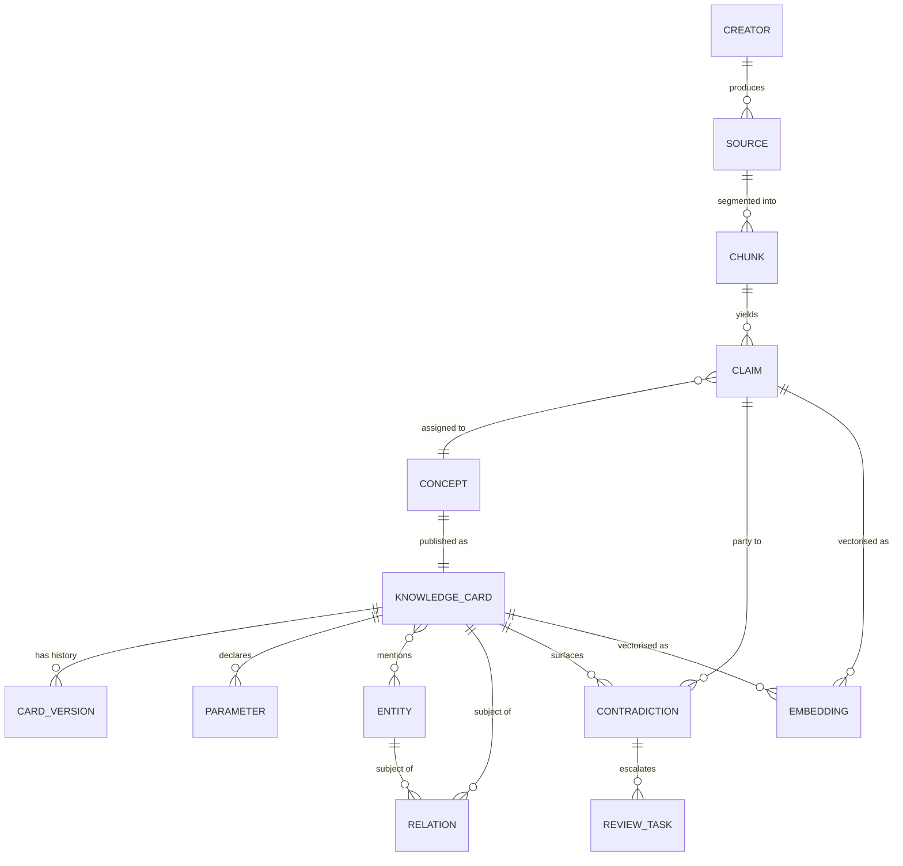

# 02 — Data Model

## 1. Object inventory

| Object | Layer | Mutability | Cardinality (est. @ 4,000 transcripts) |
| --- | --- | --- | --- |
| `Source` | L1 | Append + metadata updates | 4,000 |
| `Creator` | L1 | Slowly-changing | ~400 |
| `Chunk` | L2 | Immutable | ~600,000 |
| `Claim` | L3 | **Immutable** | ~250,000 |
| `Concept` | L4 | Canonical registry | ~6,000 |
| `KnowledgeCard` | L4 | Versioned | ~6,000 |
| `Entity` | L4 | Slowly-changing | ~3,500 |
| `Relation` | L4 | Versioned | ~40,000 |
| `Parameter` | L4 | Derived | ~9,000 |
| `Contradiction` | L4 | Stateful workflow | ~800 |
| `Embedding` | L5 | Derived, disposable | ~260,000 |
| `ReviewTask` | ops | Stateful workflow | ~2,500 |

The ratio that matters: **250,000 claims → 6,000 cards**. Roughly 40 claims per concept.
A system that produced 250,000 notes would be worthless. A system that produced 6,000
well-evidenced concepts is a moat.

---

## 2. Entity-relationship overview



---

## 3. Identifier scheme

Human-readable where a human will read it, content-addressed where collision matters.

| Object | Pattern | Example |
| --- | --- | --- |
| Creator | `crt_<slug>` | `crt_jane-doe-lashes` |
| Source | `src_<platform>_<yyyymm>_<hash8>` | `src_yt_202403_a3f9c1d2` |
| Chunk | `chk_<source_hash8>_<seq:05d>` | `chk_a3f9c1d2_00147` |
| Claim | `clm_<blake3:12>` | `clm_7d2e9f10b4a3` |
| Concept | `cpt_<DOMAIN>_<slug>` | `cpt_ADH_humidity-cure-window` |
| Knowledge Card | `kc_<DOMAIN>_<slug>` | `kc_ADH_humidity-cure-window` |
| Entity | `ent_<type>_<slug>` | `ent_chem_cyanoacrylate` |
| Relation | `rel_<blake3:12>` | `rel_11c4a8f0e7bb` |
| Parameter | `prm_<card_slug>_<name>` | `prm_humidity-cure-window_optimal-rh` |
| Contradiction | `ctr_<blake3:12>` | `ctr_9a01ff34cd12` |

Rules:

- Slugs are lowercase, hyphenated, ASCII, ≤ 60 chars, generated from the canonical title and
  **frozen at creation**. Retitling never changes the ID; the old title becomes an alias.
- Claim IDs hash `(source_id, char_span, normalized_text)` — the same sentence extracted twice
  produces the same ID, which is how idempotency is achieved for free.
- Relation IDs hash `(subject_id, predicate, object_id, qualifier_hash)`.
- Domain codes are the immutable 3-letter codes from the taxonomy.

---

## 4. Core objects

### 4.1 Creator

The reliability of the corpus is the reliability of its creators. This object is small and
carries enormous weight.

```yaml
id: crt_jane-doe-lashes
display_name: "Jane Doe"
handles:
  instagram: "@janedoelashes"
  youtube: "UC..."
role: [educator, salon_owner, brand_founder]     # multi-valued
years_experience: 11
credentials:
  - { type: certification, name: "...", issuer: "...", year: 2016, verified: true }
  - { type: license, jurisdiction: "US-CA", verified: true }
domains_of_expertise:                             # per-domain, not global
  ADH: 0.85
  RET: 0.90
  BIZ: 0.40
  HLT: 0.35
reliability_score: 0.82                           # computed, see doc 06
commercial_interest:                              # bias disclosure
  - { entity: ent_brand_xyz, nature: owner }
independence_group: ig_russian-volume-lineage     # see doc 05 §7
citation_behaviour: 0.6                           # does this creator cite sources?
correction_behaviour: 0.8                         # do they publicly correct themselves?
status: active
```

`domains_of_expertise` being per-domain rather than a single number is deliberate. A
world-class volume artist is not thereby an authority on business finance, and treating
them as one is exactly how bad advice enters a knowledge base with high confidence.

### 4.2 Source

```yaml
id: src_yt_202403_a3f9c1d2
title: "Why Your Retention Dies In Summer"
creator_id: crt_jane-doe-lashes
additional_speakers: [crt_other-guest]
platform: youtube            # podcast|youtube|instagram|tiktok|course|interview|panel|masterclass|webinar|article|book|paper
url: "https://..."
published_at: 2024-03-14
duration_seconds: 3420
language: en
region_context: US
format: monologue            # monologue|interview|panel|lecture|qa|demo
commercial_context: sponsored # organic|sponsored|own_product|affiliate|educational_paid
transcript:
  storage_uri: "s3://lke-raw/src_yt_202403_a3f9c1d2.json"
  word_count: 8214
  has_timestamps: true
  has_speaker_labels: true
  asr_confidence: 0.91       # drives downstream confidence
  transcript_quality: good   # verbatim|good|fair|poor
content_hash: "blake3:..."
independence_group: ig_russian-volume-lineage
reliability_score: 0.78      # creator score adjusted by source-level factors
processing:
  stage: complete
  pipeline_version: "1.4.0"
  claims_extracted: 63
  cards_touched: 21
```

### 4.3 Chunk

The addressable unit of the transcript. Semantic, not fixed-size.

```yaml
id: chk_a3f9c1d2_00147
source_id: src_yt_202403_a3f9c1d2
sequence: 147
text: "...cleaned, readable text..."
raw_text: "...verbatim including disfluencies..."
speaker: crt_jane-doe-lashes
t_start: 1284.5
t_end: 1331.2
char_span: [18422, 19104]
topic_label: "humidity and cure speed"
segment_type: explanation    # explanation|demo|anecdote|qa|aside|promo|intro|outro
salience: 0.74               # is this knowledge-bearing at all?
```

`segment_type: promo` is worth noting — a meaningful share of lash content is advertising.
Marking it lets the pipeline down-weight or skip it, and lets confidence scoring apply a
commercial-bias penalty.

### 4.4 Claim — the atomic unit

**Immutable. Never merged. Never edited. Never deleted.** Everything else in the system is
derived; this is the only object that records what was actually said.

```yaml
id: clm_7d2e9f10b4a3
source_id: src_yt_202403_a3f9c1d2
chunk_id: chk_a3f9c1d2_00147
speaker_id: crt_jane-doe-lashes
t_start: 1291.0
t_end: 1305.4

# --- what was said ---
verbatim_quote: "If you're above sixty percent humidity your glue is curing before it even
                 touches the lash, and that's why your bonds are brittle."
normalized_statement: "Relative humidity above 60% causes cyanoacrylate adhesive to cure
                       prematurely, producing brittle bonds."

# --- structure ---
claim_type: causal        # definitional|causal|correlational|prescriptive|parametric|
                          # comparative|predictive|evaluative|experiential|negation
subject: ent_env_relative-humidity
predicate: causes
object: ent_phen_premature-cure
polarity: positive
scope: general            # universal|general|conditional|personal|situational
conditions:
  - { variable: relative_humidity, operator: ">", value: 60, unit: "%RH" }

# --- parametric payload, when present ---
parameters:
  - name: relative_humidity_threshold
    value: 60
    unit: "%RH"
    bound: lower
    precision: stated     # stated|approximate|inferred

# --- epistemic signals ---
hedge_level: 0.05         # 0 = flat assertion, 1 = heavily hedged
certainty_language: assertive   # assertive|confident|hedged|speculative|questioning
evidence_offered: none    # none|anecdote|personal_testing|client_data|
                          # manufacturer_doc|citation|demonstration
sample_basis: null        # e.g. "8 years, ~4000 clients"
is_first_person_experience: false
is_reported_from_other: false
reported_from: null

# --- resolution ---
concept_id: cpt_ADH_humidity-cure-window
concept_confidence: 0.91
entities: [ent_env_relative-humidity, ent_chem_cyanoacrylate, ent_phen_premature-cure]

# --- housekeeping ---
extraction_model: "<model-id>"
prompt_version: "claim-extract@2.3"
extracted_at: 2026-08-10T09:14:00Z
superseded_by: null       # only if the same speaker later corrects themselves
```

Why claims carry `hedge_level` and `certainty_language`: an educator saying *"I think maybe
around sixty?"* and one saying *"above sixty, period"* produce very different evidence. Flattening
both into "60%" throws away the most useful signal in the corpus.

### 4.5 Concept

The canonical registry. Thin by design — it exists to be the deduplication target.

```yaml
id: cpt_ADH_humidity-cure-window
canonical_title: "Adhesive Humidity Cure Window"
aliases:
  - "glue humidity range"
  - "optimal humidity for adhesive"
  - "humidity and cure speed"
definition_seed: "The relative-humidity band within which cyanoacrylate adhesive polymerises
                  at a rate that produces optimal bond strength."
primary_path: [ADH, "Humidity & Temperature Response"]
centroid_embedding: [...]     # mean of assigned claim embeddings; drives dedup
claim_count: 47
independent_group_count: 9
status: active                # active|merged|deprecated|split
merged_into: null
created_at: ...
```

### 4.6 Knowledge Card — the publication unit

One concept. One card. Full schema in
[`schemas/json/knowledge_card.schema.json`](../schemas/json/knowledge_card.schema.json);
this is the annotated shape.

```yaml
# ═══ IDENTITY ═══
id: kc_ADH_humidity-cure-window
concept_id: cpt_ADH_humidity-cure-window
title: "Adhesive Humidity Cure Window"
aliases: ["glue humidity range", "optimal humidity for adhesive"]
version: 4
schema_version: "1.0.0"
taxonomy_version: "1.0.0"

# ═══ CLASSIFICATION ═══
domain: ADH
primary_path: ["Adhesive Science", "Humidity & Temperature Response"]
secondary_paths:
  - ["Retention Science", "Environmental Factors"]
  - ["Business & Operations", "Studio Environment"]
facets:
  knowledge_type: parameter
  epistemic_status: industry_consensus
  risk_tier: 1
  skill_level: foundation
  audience: [artist, educator, salon_owner]
  service_lifecycle: [application]
  context_sensitivity: [humidity, temperature, product_specific, climate]
  actionability: decisional
tags: [humidity, cyanoacrylate, cure, retention, environment]

# ═══ KNOWLEDGE BODY ═══
definition: >
  One-sentence, decontextualised statement of what the concept is. Must stand alone.
summary: >
  2–4 sentences. The answer a competent artist would give if asked to explain it quickly.
mechanism: >
  Why it is true. The causal chain. This is what separates a knowledge card from a tip.
practical_application: >
  What the artist actually does with this.
implementation_steps:
  - step: 1
    action: "Measure studio RH with a calibrated hygrometer at working height."
    detail: "..."
    claim_refs: [clm_...]
  - step: 2
    action: "..."
preconditions: ["Calibrated hygrometer", "Ability to control studio humidity"]
common_mistakes:
  - mistake: "Reading humidity from a phone weather app instead of the room."
    why_it_happens: "Convenience; unawareness of microclimate variance."
    consequence: "Adhesive choice mismatched to actual conditions."
    correction: "Measure at the lash bed, not outdoors."
    claim_refs: [clm_...]
exceptions:
  - condition: "Low-fume / sensitive adhesives"
    behaviour: "Typically require higher RH and longer set times than standard formulations."
    claim_refs: [clm_...]
edge_cases: ["Altitude above ~1500 m alters effective moisture availability."]
counter_indications: []           # when this knowledge must NOT be applied

# ═══ PARAMETRIC PAYLOAD ═══
parameters:
  - name: optimal_relative_humidity
    kind: range
    min: 45
    max: 55
    unit: "%RH"
    applies_to: ent_chem_cyanoacrylate-ethyl
    condition: "standard-viscosity adhesive, 20–24 °C"
    confidence: 0.86
    source_claims: [clm_..., clm_...]
    variance_note: "Manufacturer-specified ranges vary 35–70%; always defer to product spec."
  - name: brittle_bond_threshold
    kind: threshold
    operator: ">"
    value: 65
    unit: "%RH"
    confidence: 0.71

# ═══ DISAGREEMENT ═══
contradictions:
  - id: ctr_9a01ff34cd12
    statement: "Some educators assert 60–70% RH is optimal for fast-set adhesives."
    supporting_claims: [clm_...]
    opposing_claims: [clm_...]
    resolution_status: unresolved     # unresolved|context_dependent|resolved|superseded
    resolution_note: "Likely a genuine product-dependence rather than a factual conflict."
alternative_viewpoints:
  - viewpoint: "Humidity matters less than adhesive freshness."
    held_by: [crt_...]
    weight: 0.2

# ═══ EVIDENCE & CONFIDENCE ═══
confidence:
  score: 0.86
  band: high                         # very_low|low|moderate|high|very_high
  computed_at: 2026-08-10T09:20:00Z
  formula_version: "conf@1.2"
  components:
    evidence_strength: 0.85
    source_quality: 0.81
    consensus: 0.78
    corroboration: 0.95
    recency: 0.90
    specificity: 0.88
  penalties:
    hedging: 0.02
    commercial_bias: 0.03
evidence:
  claim_count: 47
  supporting_claims: 41
  contradicting_claims: 6
  independent_source_groups: 9
  distinct_creators: 22
  highest_evidence_tier: manufacturer_spec
  evidence_ledger:
    - tier: manufacturer_spec
      count: 4
    - tier: structured_practitioner_test
      count: 7
    - tier: expert_assertion
      count: 29
    - tier: anecdote
      count: 7
  date_range: [2019-04-02, 2026-05-11]

# ═══ PROVENANCE ═══
sources:
  - source_id: src_yt_202403_a3f9c1d2
    creator_id: crt_jane-doe-lashes
    platform: youtube
    published_at: 2024-03-14
    timestamps: [[1291.0, 1305.4]]
    claim_ids: [clm_7d2e9f10b4a3]
    stance: supports                 # supports|contradicts|qualifies|neutral
    reliability_score: 0.78
key_quotes:
  - claim_id: clm_7d2e9f10b4a3
    quote: "..."
    attribution: "Jane Doe, YouTube, 2024-03-14 @ 21:31"

# ═══ GRAPH ═══
entities: [ent_env_relative-humidity, ent_chem_cyanoacrylate, ent_phen_premature-cure]
relations:
  - { predicate: affects, object: kc_ADH_cure-kinetics, strength: 0.9, polarity: negative }
  - { predicate: affects, object: kc_RET_bond-durability, strength: 0.8 }
  - { predicate: measured_by, object: ent_tool_hygrometer }
related_concepts: [kc_ADH_temperature-response, kc_RET_environmental-factors]
prerequisites: [kc_ADH_cyanoacrylate-chemistry]
supersedes: []

# ═══ LASHOS PRODUCT LAYER ═══
lashos:
  usable: true
  usable_rationale: "Parametric, high confidence, low risk, directly actionable."
  gating:
    min_confidence_to_assert: 0.70
    requires_citation: false
    requires_human_review: false
    requires_disclaimer: false
  ai_features:
    - feature: retention_expert
      use: "Primary environmental factor in retention diagnosis."
      integration: parameter_lookup
    - feature: troubleshooting_assistant
      use: "Root-cause branch for brittle-bond and premature-shed symptoms."
      integration: diagnostic_tree_node
    - feature: product_recommender
      use: "Filter adhesives by humidity envelope vs studio RH."
      integration: rule_filter
  decision_support:
    - "Recommend adhesive by measured studio RH."
    - "Flag studio environment as root cause before blaming technique."
  course_modules:
    - module: "Environment Control for Retention"
      level: foundation
      role: core_concept
  client_intelligence: []
  retention_intelligence:
    - "Feature `studio_rh_deviation` in the retention prediction model."
  styling_intelligence: []
  business_intelligence:
    - "Justifies capex on humidity control; model against retention-driven rebook lift."

# ═══ LIFECYCLE ═══
status: published                 # draft|in_review|published|contested|deprecated
review:
  required: false
  reviewed_by: null
  reviewed_at: null
created_at: 2026-06-02T10:00:00Z
updated_at: 2026-08-10T09:20:00Z
last_evidence_at: 2026-05-11
human_override_present: false
```

### 4.7 Entity

```yaml
id: ent_chem_cyanoacrylate-ethyl
type: chemical
canonical_name: "Ethyl cyanoacrylate"
aliases: ["ECA", "ethyl-2-cyanoacrylate"]
description: "..."
attributes:
  cas_number: "7085-85-0"
  polymerisation_trigger: "ambient moisture (anionic)"
  typical_use: "standard-viscosity lash adhesive base monomer"
external_ids:
  pubchem: "..."
mentioned_in_cards: [kc_ADH_...]
relations: [...]
risk_flags: [sensitiser, irritant]
```

**Entity types** (full list in [`taxonomy/entity_types.yaml`](../taxonomy/entity_types.yaml)):
`concept` `technique` `style` `product` `product_category` `brand` `tool` `chemical`
`material` `condition` `symptom` `anatomical_structure` `eye_shape` `lash_trait`
`environmental_factor` `metric` `business_process` `role` `person` `organization`
`regulation` `region` `client_segment` `protocol` `myth` `phenomenon`

### 4.8 Relation

```yaml
id: rel_11c4a8f0e7bb
subject_id: kc_ADH_humidity-cure-window
subject_type: card
predicate: affects
object_id: kc_RET_bond-durability
object_type: card
polarity: negative        # positive|negative|nonlinear|neutral
strength: 0.8             # 0–1 belief in the relationship
mechanism_card: kc_ADH_flash-cure
conditions:
  - { variable: relative_humidity, operator: ">", value: 65, unit: "%RH" }
confidence: 0.81
evidence_claims: [clm_..., clm_...]
directionality: directed  # directed|bidirectional
temporality: immediate    # immediate|delayed|cumulative
extraction_method: llm    # llm|rule|human|imported
status: active
```

### 4.9 Contradiction

```yaml
id: ctr_9a01ff34cd12
concept_id: cpt_ADH_storage-refrigeration
statement_a:
  proposition: "Refrigerating unopened adhesive extends shelf life."
  claims: [clm_...]
  creators: [crt_a, crt_b]
  independent_groups: 3
  weight: 0.55
statement_b:
  proposition: "Refrigeration introduces condensation and degrades adhesive."
  claims: [clm_...]
  creators: [crt_c, crt_d, crt_e]
  independent_groups: 4
  weight: 0.45
conflict_type: factual    # factual|definitional|contextual|terminological|
                          # product_specific|temporal|values
resolution_status: unresolved
resolution_hypothesis: "May be product- and handling-dependent: sealed + full acclimatisation
                        vs improper thaw. Requires controlled test."
resolution_evidence_needed: "Manufacturer specification survey; controlled shelf-life test."
ai_handling: present_both  # present_both|present_majority_with_caveat|suppress|refer_to_expert
detected_at: ...
review_task_id: rev_...
```

`ai_handling` is the field that stops the AI from confidently picking a side it has no
grounds to pick.

### 4.10 Parameter

Extracted into its own table so it can be queried as structured data rather than parsed
out of prose. This is the substrate of every predictive and recommendation feature.

```yaml
id: prm_humidity-cure-window_optimal-rh
card_id: kc_ADH_humidity-cure-window
name: optimal_relative_humidity
kind: range               # scalar|range|threshold|ratio|enum|duration|curve
min: 45
max: 55
value: null
unit: "%RH"
applies_to_entity: ent_chem_cyanoacrylate-ethyl
condition_expr: "viscosity=standard AND temp_c BETWEEN 20 AND 24"
confidence: 0.86
source_claim_ids: [...]
disputed: false
```

---

## 5. Immutability and versioning rules

| Object | Rule |
| --- | --- |
| Claim | Immutable forever. A speaker correcting themselves creates a *new* claim linked by `supersedes`. |
| Chunk | Immutable. Re-segmentation creates new chunks under a new pipeline version. |
| Source | Metadata may be corrected; transcript content is content-hashed and frozen. |
| Card | Versioned. Every change writes a `card_versions` row with a full snapshot and a change reason. |
| Relation | Versioned; superseded rather than deleted. |
| Entity | Slowly-changing; merges recorded via `merged_into`. |
| Embedding | Fully disposable — regenerated whenever the model or card text changes. |

**The regeneration guarantee:** delete the entire cards table, the vector store, the graph
projection and the vault, re-run S4→S9 from the claims, and you get an equivalent knowledge
base. Only claims, sources and human decisions (review outcomes, override blocks, manual
merges) are irreplaceable — and those are the three things that are backed up hardest.

---

## 6. Human override safety

The vault is generated, but humans will want to edit it. Rather than fight that, cards carry
an explicitly delimited round-trip-safe region:

```markdown
<!-- LKE:HUMAN-OVERRIDE:START -->
Anything here is preserved verbatim across regeneration and is round-tripped into
`cards.human_override_md` in Postgres on the next vault sync.
<!-- LKE:HUMAN-OVERRIDE:END -->
```

Anything outside those markers is machine-owned and will be overwritten without warning.
The vault sync job reads override blocks back into the database *before* any regeneration
run, so the database remains the single source of truth even for human-authored content.
