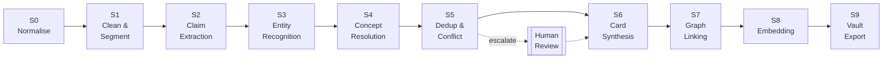
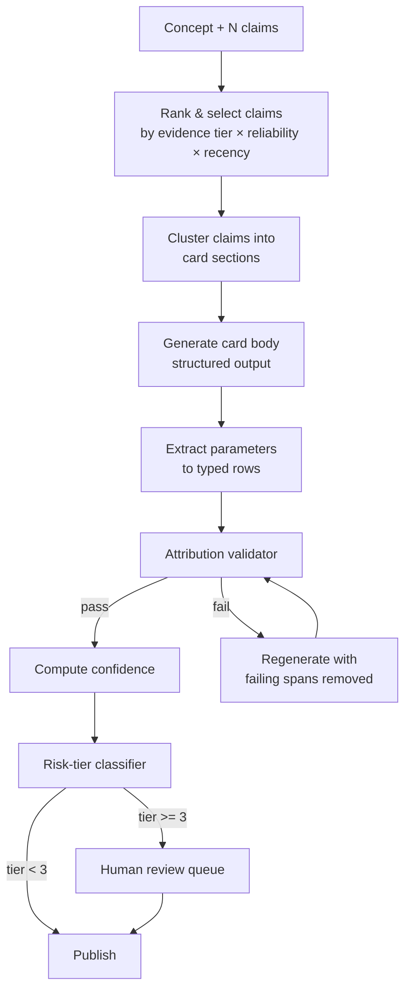
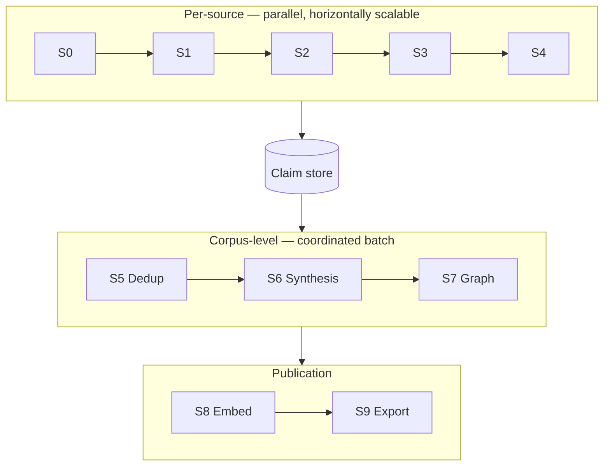

# 03 — Extraction Pipeline

## 1. Pipeline overview

Ten stages, S0–S9. Each is an independently versioned, content-addressed, idempotent
transformation. The user-facing "8 stages" map onto these with two additions: normalisation
(S0) and concept resolution (S4), which is the stage that makes deduplication tractable
rather than a brute-force N² problem.



**Fan-in point.** S0–S4 run per-source and parallelise freely across thousands of transcripts.
S5–S7 operate on the *concept* population and must run as coordinated batches — this is
where the corpus becomes a knowledge base rather than 4,000 independent extractions.

---

## 2. Stage specifications

### S0 · Normalise

**Input:** heterogeneous transcript files (VTT, SRT, JSON, DOCX, TXT) + media metadata.
**Output:** `Source` record + canonical transcript JSON in object storage.

| Step | Detail |
| --- | --- |
| Format detection | Sniff and dispatch to the appropriate parser |
| Timestamp normalisation | Everything to float seconds from media start |
| Speaker normalisation | Map diarisation labels (`SPEAKER_00`) to `Creator` IDs where resolvable; otherwise stable per-source pseudonyms |
| Encoding & unicode | NFC normalisation, smart-quote folding, emoji retention |
| Content hashing | `blake3(normalised_text)` — the deduplication key for *sources* |
| Quality assessment | ASR confidence, timestamp presence, speaker-label presence → `transcript_quality` |
| Metadata enrichment | Platform, creator, date, URL, duration, commercial context |

**Duplicate-source detection happens here.** The same podcast episode republished on three
platforms is one `content_hash`. It becomes one `Source` with multiple `distribution` entries,
never three independent corroborating sources — which would otherwise inflate confidence by 3×
for free.

**Rejection criteria:** ASR confidence < 0.55, word count < 200, or non-target language
without translation → quarantine with a reason code rather than silent drop.

---

### S1 · Clean & Segment

**Input:** canonical transcript. **Output:** `Chunk[]`.
**Model class:** small/fast. **Cost profile:** high volume, low unit cost.

Cleaning is *conservative*: it must never change meaning, because the verbatim quote is
downstream evidence.

| Operation | Rule |
| --- | --- |
| Disfluency removal | Remove "um", "uh", false starts; **retain** hedges ("I think", "maybe") — those are epistemic signal, not noise |
| Sentence reconstruction | Repair ASR sentence boundaries |
| ASR error correction | Domain lexicon repair: "cyanoacrylate", "isolation", "megavolume", curl codes, brand names. Corrections are logged, not silent |
| Filler-content marking | Intros, outros, sponsor reads, giveaways → `segment_type` |
| Speaker attribution | Per-utterance; unresolved speakers flagged |
| Semantic segmentation | Topic-boundary detection, target 150–400 words, hard max 600 |
| Salience scoring | Does this chunk contain any candidate assertion? Low-salience chunks skip S2 entirely |

Both `raw_text` and cleaned `text` are retained. The verbatim quote shown to a user always
comes from `raw_text` — polished quotes that a creator never said are an attribution failure.

**Salience gating typically removes 40–60% of chunks before the expensive stage**, which is
the single largest cost lever in the pipeline.

---

### S2 · Claim Extraction — the critical stage

**Input:** salient `Chunk[]`. **Output:** `Claim[]`.
**Model class:** frontier. **This stage determines the ceiling on system quality.**

Extraction is structured-output only, validated against
[`schemas/json/extraction_output.schema.json`](../schemas/json/extraction_output.schema.json).
Anything failing validation is retried once, then quarantined for review — never coerced.

**Extraction rules given to the model:**

1. One claim = one assertion. Compound statements are split.
2. `verbatim_quote` must appear character-for-character in `raw_text`. **Verified programmatically
   after generation**; a claim whose quote does not match is discarded. This is the hard guarantee
   against fabricated attribution.
3. `normalized_statement` is decontextualised — resolve pronouns and deixis ("this", "that
   thing I mentioned") into explicit references, so the claim stands alone.
4. Preserve hedging in `hedge_level` / `certainty_language`; never in the normalised statement.
5. Extract conditions explicitly. *"In summer I use a faster glue"* is conditional on season,
   not a universal prescription.
6. Extract numeric parameters with units. Unitless numbers are flagged `precision: inferred`.
7. Distinguish first-hand experience from reported hearsay (`is_reported_from_other`) — this
   feeds echo-chamber detection in S5.
8. Do not extract from `segment_type: promo` unless the claim is technical and independently
   verifiable.
9. Do not infer. If the speaker did not say it, it is not a claim.

**Post-generation validators (deterministic, non-LLM):**

| Validator | Action on failure |
| --- | --- |
| Verbatim substring match | Discard claim |
| Timestamp within chunk bounds | Clamp + warn |
| Unit in controlled vocabulary | Flag for review |
| Claim type in enum | Discard |
| Numeric plausibility (e.g. diameter 0.03–0.30 mm, RH 0–100) | Flag as probable ASR error |
| Duplicate claim ID within source | Deduplicate |

Yield expectation: **~60 claims per hour of content**, of which ~70% are knowledge-bearing
and ~30% are conversational or promotional residue.

---

### S3 · Entity Recognition & Linking

**Input:** `Claim[]`. **Output:** claims annotated with entity IDs; new `Entity` candidates.

Two-pass:

1. **Recognise** — span detection over a closed type set, using a gazetteer of known entities
   (brands, chemicals, tools, curls, conditions, styles) plus model-based NER for novel mentions.
2. **Link** — resolve each mention to a canonical entity via exact alias match → embedding
   nearest-neighbour (≥ 0.88) → LLM adjudication for the ambiguous band.

Unresolved mentions crossing a frequency threshold (≥ 3 sources) become new entity candidates
and enter the review queue. Below threshold they are held as unlinked mentions — the corpus
is full of one-off brand mentions that should not each become a permanent entity.

**Normalisation is where most value is created here.** "0.07", ".07", "07 thickness" and
"seven" all resolve to `diameter_mm: 0.07`. Without this, every parametric query fails.

---

### S4 · Concept Resolution

**Input:** annotated `Claim[]`. **Output:** claims assigned to `Concept` IDs.

This is the stage that makes deduplication O(N) instead of O(N²). Rather than comparing
6,000 cards to each other, every claim is resolved *at extraction time* against a canonical
concept registry.

```
for each claim:
    q = embed(normalized_statement)
    candidates = concept_registry.ann_search(q, k=15)
                 ∪ alias_exact_match(claim.subject)
                 ∪ taxonomy_sibling_lookup(predicted_domain)

    score = 0.45·cosine(q, candidate.centroid)
          + 0.20·entity_jaccard(claim.entities, candidate.entities)
          + 0.15·predicate_match(claim.predicate, candidate.predicates)
          + 0.10·taxonomy_proximity(claim.domain, candidate.primary_path)
          + 0.10·title_token_overlap

    if best.score ≥ 0.82           → assign to existing concept
    elif best.score ≥ 0.68         → LLM adjudication: same concept or new?
    else                           → create new concept (provisional)
```

Provisional concepts are promoted to active once they accumulate ≥ 2 claims from ≥ 2
independent source groups. Singleton provisional concepts are held in a staging area and
swept periodically — this prevents a single offhand remark from minting a permanent concept.

The concept centroid is recomputed incrementally as claims are assigned, so the registry
sharpens as the corpus grows.

---

### S5 · Deduplication & Conflict Detection

Full specification in [05 — Deduplication](05-deduplication.md). Summary of what happens here:

- Concept-level near-duplicate detection and merging
- Variant/specialisation detection → parent-child linking rather than merging
- **Contradiction detection** → `Contradiction` objects, blocked from merging
- **Evolution detection** → card versioning with `supersedes`
- Echo-chamber / independence-group analysis
- Escalation to human review for: risk_tier ≥ 2 conflicts, unresolved contradictions with
  balanced weight, and merges the model flags as low-certainty

---

### S6 · Card Synthesis

**Input:** a `Concept` + its full `Claim` set + existing card (if any). **Output:** `KnowledgeCard`.
**Model class:** frontier. **This is the customer-visible output.**



**Claim selection.** Where a concept has 200+ claims, all are retained as evidence but only a
ranked subset enters the synthesis context: highest evidence tier, highest source reliability,
maximum viewpoint diversity (deliberately including minority positions so contradictions
survive synthesis), and recency-weighted. Target ~40 claims in context.

**The attribution validator is the most important component in this stage.** After generation,
every substantive assertion in the card body is checked for entailment against its cited
claims. Sentences with no supporting claim are removed, not rewritten. The card may end up
shorter than an LLM would naturally write — that is the correct trade.

**Regeneration policy.** When new claims arrive for an existing card:

| Trigger | Action |
| --- | --- |
| < 5 new claims, no contradiction, confidence Δ < 0.05 | Update evidence counts only; body untouched |
| ≥ 5 new claims, or new parameter, or confidence Δ ≥ 0.05 | Regenerate body, bump version |
| New contradiction detected | Regenerate + flag `status: contested` |
| Superseding evidence (higher tier contradicts current body) | Regenerate + version + `supersedes` link |

This prevents the "every ingest rewrites every card" thrash that makes vault diffs useless.

---

### S7 · Graph Linking

**Input:** published cards + entities. **Output:** `Relation[]`.

Three complementary extraction methods, in order of trust:

1. **Structural** (deterministic) — taxonomy edges (`subclass_of`, `part_of`), prerequisite
   edges from `preconditions`, parameter edges from `applies_to`. Confidence 1.0.
2. **Claim-derived** — any claim with `claim_type: causal|correlational` already carries
   `subject / predicate / object`. These promote directly to relations, carrying claim
   confidence. This is the highest-value source and is nearly free.
3. **Model-inferred** — cross-card relation extraction over co-occurring concepts, using the
   closed predicate vocabulary. Confidence capped at 0.75 and never used alone for risk_tier ≥ 2.

**Graph hygiene** runs after linking:

- Cycle detection on `causes` / `prevents` (cycles are usually extraction errors — except
  legitimate feedback loops, which must be explicitly whitelisted)
- Transitive redundancy pruning (A→B→C plus A→C: keep A→C only if independently evidenced)
- Contradictory edge detection (A `causes` B and A `prevents` B → contradiction object)
- Orphan detection (a card with zero relations is a classification failure, not a fact)
- Hub analysis (an entity with 500+ edges is usually under-specified and needs splitting)

---

### S8 · Embedding

Full detail in [07 — RAG Architecture](07-rag-architecture.md). Four collections:

| Collection | Unit embedded | Purpose |
| --- | --- | --- |
| `card_summary` | title + definition + summary | Conceptual retrieval |
| `card_section` | each section independently | Precise passage retrieval |
| `claim` | `normalized_statement` | Evidence grounding, citation, contradiction retrieval |
| `quote` | `verbatim_quote` | "What did *she* actually say?" — educator voice retrieval |

Embeddings carry the full metadata payload (domain, facets, confidence, risk tier, dates,
creator, parameters) so filtering happens in the vector store rather than after retrieval.

---

### S9 · Vault Export

Deterministic rendering, zero model calls. Detail in [08 — Obsidian Vault](08-obsidian-vault.md).

Critically: **read human override blocks back into Postgres before writing anything.** The
export is destructive to machine-owned regions and must never destroy human work.

```
1. Scan vault for LKE:HUMAN-OVERRIDE blocks → upsert to cards.human_override_md
2. Render cards, entities, sources, contradictions, MOCs from database
3. Write to a staging directory
4. Diff staging vs live vault
5. Apply, and emit a changelog note into 00-System/
```

Step 4 exists so a bug in a template cannot silently delete 6,000 files. If the diff exceeds
a configured threshold of deletions, the export halts and requires confirmation.

---

## 3. Orchestration



- **Per-source flow** triggers on new source arrival; concurrency limited only by API rate
  limits. A single transcript takes ~3–6 minutes wall-clock.
- **Corpus flow** runs on a schedule (nightly during backfill, then daily) or when the
  unprocessed-claim count crosses a threshold. It only touches concepts with new claims.
- **Publication flow** runs after the corpus flow, only for changed cards.

**Backfill strategy for the initial 4,000 transcripts:** do not run the corpus flow until a
representative seed (~200 sources, stratified across domains and creators) has been through
S0–S4. Building the concept registry from a random first-50 produces a badly shaped registry
that every subsequent source has to fight against. Seed deliberately, review the registry by
hand once, *then* open the firehose.

---

## 4. Idempotency and reprocessing

Every artifact records:

```yaml
pipeline_version: "1.4.0"
stage_version: { s1: "1.2", s2: "2.3", s6: "1.7" }
prompt_versions: { claim_extract: "2.3", card_synth: "1.7" }
model_ids: { s2: "...", s6: "..." }
config_hash: "blake3:..."
```

Reprocessing is selective by construction:

| Change | Invalidates | Preserved |
| --- | --- | --- |
| S1 cleaning rules | S1–S9 for affected sources | Source records |
| S2 extraction prompt | S2–S9 for affected sources | Chunks; **old claims retained**, new claims added, divergences reviewed |
| Concept registry restructure | S4–S9 | All claims |
| Card synthesis prompt | S6–S9 | All claims, concepts, dedup decisions, **human review outcomes** |
| Embedding model | S8 only | Everything |
| Vault template | S9 only | Everything, including human override blocks |

**Human decisions are never invalidated by a model change.** Review outcomes, manual merges
and override text persist across every reprocessing scenario. That property is what makes it
safe to improve the pipeline aggressively after launch.

---

## 5. Observability

Per-stage metrics, all of which have alert thresholds:

| Metric | Why it matters | Alert |
| --- | --- | --- |
| Claims per 1k words | Extraction health | Drop > 30% vs baseline |
| Verbatim validation failure rate | Fabrication guard | > 2% |
| Schema validation failure rate | Prompt drift | > 5% |
| New-concept creation rate | Registry health | Rising after 1,000 sources = registry not converging |
| Merge rate in S5 | Dedup effectiveness | Falling below 15% = under-merging |
| Contradiction detection rate | Conflict sensitivity | Sudden change either way |
| Mean card confidence | Corpus quality | Trend down |
| Orphan card ratio | Graph health | > 5% |
| Human review queue depth | Sustainability | > 200 open |
| Cost per source | Unit economics | > 1.3× budget |

The one to watch during backfill is **new-concept creation rate**. It should fall
asymptotically. If concept count is still growing linearly at source 2,000, concept
resolution is failing and every downstream stage is compounding the error — stop the
backfill rather than spend the remaining budget producing duplicates.
