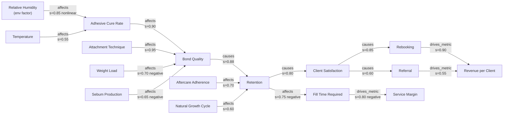

# 04 — Knowledge Graph

## 1. Why a graph at all

Vector search answers *"what text is similar to this question?"* That is sufficient for
lookup and insufficient for everything LashOS is meant to do. The graph exists to answer
questions that require **traversal**:

| Question | Requires |
| --- | --- |
| "Why did retention fail?" | Reverse causal traversal from a symptom |
| "What will happen if I move to a 0.05 diameter?" | Forward causal traversal with parameters |
| "What must a student learn before volume fans?" | Prerequisite DAG |
| "Which products suit this client?" | Constraint satisfaction over entity attributes |
| "What's the business impact of poor retention?" | Multi-hop chain into commercial outcomes |
| "What do we not know?" | Structural gap detection |

None of these are retrieval problems. All of them are graph problems.

---

## 2. Node model

Nodes come in three classes, unified by a common interface.

| Class | Node types | Source |
| --- | --- | --- |
| **Knowledge nodes** | `KnowledgeCard` | One per concept |
| **Entity nodes** | 26 entity types (see taxonomy) | Extracted and curated |
| **Structural nodes** | `TaxonomyNode`, `Contradiction`, `Source`, `Creator`, `Parameter` | System-generated |

Every node carries: `id`, `type`, `label`, `domain`, `confidence`, `risk_tier`, `status`.
That common header is what allows generic traversal algorithms to reason about
trustworthiness without knowing node semantics.

---

## 3. Relation vocabulary

A closed predicate set. Open-vocabulary relation extraction produces graphs that look
impressive and cannot be queried, because `influences`, `impacts`, `affects` and
`has_effect_on` end up as four different edges meaning one thing.

### 3.1 Causal & influence

| Predicate | Semantics | Qualifiers |
| --- | --- | --- |
| `causes` | A produces B | `strength`, `polarity`, `temporality`, `conditions` |
| `affects` | A modulates B without determining it | `strength`, `polarity`, `curve` |
| `prevents` | A reduces or blocks B | `strength`, `conditions` |
| `mitigates` | A reduces severity of B | `strength` |
| `exacerbates` | A worsens B | `strength` |
| `correlates_with` | Association without established mechanism | `strength`, `direction` |
| `trade_off_with` | Improving A degrades B | `curve` |
| `threshold_for` | A crosses a boundary that triggers B | `value`, `unit`, `operator` |

### 3.2 Diagnostic

| Predicate | Semantics |
| --- | --- |
| `indicates` | Symptom → likely root cause (with `likelihood`) |
| `differentiates_from` | Distinguishes two confusable conditions |
| `diagnosed_by` | Condition → test or observation |
| `presents_as` | Cause → observable signature |

The diagnostic subgraph is the direct substrate of the AI Troubleshooting Assistant. Its
edges are the ones most worth curating by hand.

### 3.3 Procedural & pedagogical

| Predicate | Semantics |
| --- | --- |
| `requires` | Hard dependency |
| `prerequisite_of` | Learning-order dependency (builds the curriculum DAG) |
| `precedes` | Temporal ordering within a procedure |
| `part_of` | Composition |
| `performed_with` | Technique → tool |
| `produces` | Technique → outcome |

### 3.4 Taxonomic & definitional

`subclass_of` · `instance_of` · `alias_of` · `defined_by` · `measured_by` · `quantified_by`

### 3.5 Applicability & constraint

| Predicate | Semantics |
| --- | --- |
| `applies_to` | Knowledge → context (eye shape, skin type, climate, region) |
| `contraindicated_with` | Must not be combined |
| `suitable_for` | Positive match to a client/context profile |
| `unsuitable_for` | Negative match |
| `optimal_range_for` | Parameter → target entity |
| `compatible_with` / `incompatible_with` | Product interoperability |

### 3.6 Epistemic

| Predicate | Semantics |
| --- | --- |
| `supports` | Evidence strengthens a claim |
| `contradicts` | Direct conflict |
| `refines` | More precise successor |
| `supersedes` | Replaces outdated knowledge |
| `debunks` | Corrects a myth |
| `derived_from` | Provenance edge to source material |

### 3.7 Commercial

`alternative_to` · `substitutes_for` · `manufactured_by` · `distributed_by` ·
`priced_at` · `used_in_service` · `drives_metric`

---

## 4. Edge properties

Edges are not bare pointers. Every edge carries:

```yaml
strength: 0.0–1.0        # magnitude of the effect
confidence: 0.0–1.0      # belief that the edge exists at all
polarity: positive | negative | nonlinear | neutral
temporality: immediate | delayed | cumulative | permanent
conditions: [ {variable, operator, value, unit} ]
mechanism_card: kc_...   # the card explaining WHY
evidence_claims: [clm_...]
extraction_method: structural | claim_derived | model_inferred | human
```

**`strength` and `confidence` are orthogonal and conflating them is a common design error.**
"Humidity strongly affects cure speed, and we are certain of this" is `strength 0.9,
confidence 0.9`. "Diet may weakly affect retention, and we are unsure" is `strength 0.2,
confidence 0.3`. A single number cannot express both, and traversal needs both: strength for
ranking effect size, confidence for deciding whether to mention it at all.

**`conditions` is what makes the graph context-aware.** The edge
`relative_humidity --affects--> cure_rate` with `conditions: [{RH, ">", 55}]` only fires when
the client context actually satisfies it.

---

## 5. Worked example — the retention causal chain

The chain from your brief, fully specified:



Note what this structure gives you that prose cannot:

- **Multi-causal honesty.** Bond quality has five inputs. An AI traversing this cannot say
  "your retention problem is humidity" — it must rank across all parents by
  `strength × context_match`.
- **Commercial grounding.** Retention connects to revenue through an explicit path, so the
  Business Coach and the Retention Expert reason over the *same* graph. That is what makes
  the platform coherent instead of nine separate chatbots.
- **The fill-time branch.** Poor retention costs money twice — lost rebooking *and* longer
  fills at the same price. Most educators discuss only the first. The graph surfaces the
  second automatically because both edges exist.

---

## 6. Traversal patterns

### 6.1 Diagnostic (reverse causal)

```python
def diagnose(symptom_node, context, max_depth=4):
    """Rank root causes for an observed symptom, weighted by context match."""
    paths = graph.reverse_traverse(
        symptom_node,
        predicates=["causes", "affects", "indicates"],
        max_depth=max_depth,
        min_edge_confidence=0.5,
    )
    for p in paths:
        # path strength decays multiplicatively — long chains are weak explanations
        p.score = (
            prod(e.strength * e.confidence for e in p.edges)
            * context_match(p.root, context)      # 0 if conditions unmet
            * card_confidence(p.root)
        )
    return rank(paths)
```

`context_match` returning 0 for unmet conditions is the mechanism that stops the assistant
from suggesting a humidity problem to an artist whose studio reads 48% RH.

### 6.2 Impact projection (forward causal)

Used by the Business Coach: *"if retention improves 15%, what moves?"* Forward traversal
with effect propagation, terminating at nodes typed `metric`.

### 6.3 Curriculum generation (prerequisite DAG)

```
subgraph = cards where domain ∈ target ∧ skill_level ≤ target_level
edges     = prerequisite_of ∪ requires
ordering  = topological_sort(subgraph)
modules   = community_detection(subgraph, resolution=1.2)
sequence  = modules ordered by mean topological depth
```

Course generation is a **graph algorithm**, not a prompt. That is why the AI Course Generator
can produce a defensible curriculum rather than a plausible-sounding list of topics.

### 6.4 Recommendation (constraint satisfaction)

```
candidates = entities of type product, category = adhesive
filter     : optimal_range_for.humidity ∋ studio_rh
           ∧ ¬contraindicated_with(client.sensitivities)
           ∧ set_time compatible_with artist.speed_percentile
rank       : Σ suitability_edge.strength × card.confidence
explain    : return the edges that drove the ranking
```

The `explain` step matters commercially: a recommendation that can cite *why* is defensible
to a professional audience. One that cannot is a black box that artists will not trust.

### 6.5 Gap detection

Structural queries that identify what the corpus is missing — feeding the acquisition strategy:

- Nodes with high betweenness centrality but low card confidence → **critical and under-evidenced**
- Domains where mean `independent_source_groups` < 3 → **thin coverage**
- `contradicts` edges with balanced weight and no resolution → **open industry questions**
- Entities referenced by ≥ 10 claims but holding no card → **missing concepts**

This turns "what transcripts should I acquire next?" from guesswork into a query.

---

## 7. Storage strategy

| Phase | Store | Rationale |
| --- | --- | --- |
| v1 (< 100k edges) | PostgreSQL adjacency tables + recursive CTEs | One database, no sync, transactional consistency with cards. Traversals to depth 5 run in milliseconds at this size. |
| v2 (100k–2M edges) | Postgres + Apache AGE | openCypher inside Postgres; still one system of record |
| v3 (> 2M edges, heavy analytics) | Neo4j as a read projection | Only when centrality, community detection and pathfinding at scale become the bottleneck |

**Do not start with Neo4j.** Two systems of record on day one buys sync bugs and operational
overhead in exchange for query features that do not matter below ~100k edges. The migration
path is real and cheap: the `relations` table is already a property graph.

Recursive CTE traversal, v1:

```sql
WITH RECURSIVE causal_path AS (
    SELECT subject_id, object_id, predicate, strength, confidence,
           1 AS depth,
           ARRAY[subject_id] AS path,
           strength * confidence AS cumulative
    FROM relations
    WHERE object_id = $1 AND predicate IN ('causes','affects','indicates')
      AND status = 'active' AND confidence >= 0.5

    UNION ALL

    SELECT r.subject_id, r.object_id, r.predicate, r.strength, r.confidence,
           cp.depth + 1,
           cp.path || r.subject_id,
           cp.cumulative * r.strength * r.confidence
    FROM relations r
    JOIN causal_path cp ON r.object_id = cp.subject_id
    WHERE cp.depth < 4
      AND NOT r.subject_id = ANY(cp.path)     -- cycle guard
      AND cp.cumulative > 0.05                -- prune weak chains
      AND r.status = 'active'
)
SELECT * FROM causal_path ORDER BY cumulative DESC;
```

---

## 8. Graph quality controls

| Control | Implementation | Failure it prevents |
| --- | --- | --- |
| Closed predicate vocabulary | Enum constraint in DB | Unqueryable synonym sprawl |
| Type compatibility matrix | Per-predicate allowed subject/object types | `brand causes humidity` |
| Cycle detection | Run after each S7 batch on `causes`/`prevents` | Circular reasoning in diagnosis |
| Redundant transitive pruning | Keep A→C only with independent evidence | Inflated apparent connectivity |
| Contradictory edge pairs | A causes B ∧ A prevents B → Contradiction | Silent incoherence |
| Hub splitting | Alert at degree > 500 | Under-specified god-entities |
| Orphan sweep | Cards with 0 edges | Mis-classified or trivial cards |
| Confidence floor for traversal | Configurable per feature | Low-quality edges driving advice |

The type compatibility matrix deserves emphasis: it is a small piece of configuration that
eliminates the majority of nonsense edges model-based extraction produces, at zero runtime cost.
