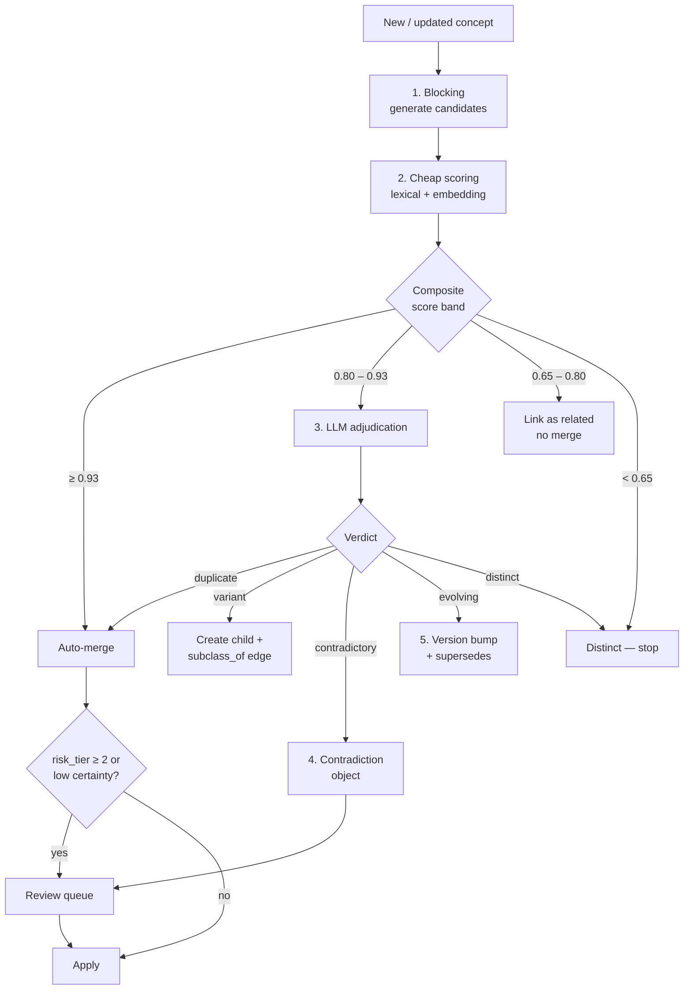

# 05 — Deduplication & Conflict Resolution

## 1. The problem, quantified

4,000 transcripts × ~60 claims = ~250,000 claims. If humidity is discussed in 800 of them,
a naive system produces 800 notes about humidity. The knowledge base becomes less useful with
every transcript added — the exact opposite of the intended property.

Correct behaviour: those 800 claims collapse into **~12 distinct concepts**
(optimal range, measurement method, seasonal variation, flash curing, dehumidifier selection,
climate-specific adhesive choice, humidity vs temperature interaction, …), each a card whose
confidence *rises* as claims accumulate.

**The system must get more valuable per unit of input, not more cluttered.** That is the
single design requirement this document serves.

---

## 2. Where deduplication happens

| Layer | Deduplicated? | Why |
| --- | --- | --- |
| Source | **Yes** — by content hash | Same episode on 3 platforms is 1 source, not 3× confidence |
| Chunk | No | Chunks are addresses, not knowledge |
| Claim | **No — deliberately** | Claim count is the evidence signal. Merging claims destroys confidence data |
| Concept | **Yes — aggressively** | This is where duplication is harmful |
| Card | Yes, as a consequence of concept dedup | One concept, one card, enforced by unique constraint |
| Entity | Yes | Alias resolution |
| Relation | Yes | Same triple = same edge, evidence appended |

The critical asymmetry: **claims are never merged; concepts always are.** Forty educators
saying the same thing is not redundancy to be eliminated — it is corroboration to be counted.

---

## 3. The four outcomes

Every candidate pair resolves to exactly one of these. Conflating them is the most common
failure in knowledge-base design.

| Outcome | Definition | Action |
| --- | --- | --- |
| **Duplicate** | Same concept, different words | Merge into canonical; append claims; recompute confidence; record alias |
| **Variant** | Related but genuinely distinct (specialisation, sub-case, different context) | Keep separate; create `subclass_of` / `applies_to` edge |
| **Contradictory** | Same concept, incompatible assertions | **Never merge.** Create `Contradiction`; both positions preserved on the card |
| **Evolving** | Same concept, newer knowledge supersedes older | Version the card; `supersedes` edge; old version retained in history |

A system that only implements "duplicate vs not" collapses contradictions into incoherent
cards and loses the industry's most interesting information.

---

## 4. The cascade

Five stages, cheapest first. Each stage discards candidates so the expensive stage sees ~2%
of the pair space.



### Stage 1 — Blocking (candidate generation)

Never compare all pairs. Candidates come from the union of five cheap generators:

| Generator | Method | Typical yield |
| --- | --- | --- |
| Exact normalised title | Lowercase, destem, strip stopwords | 0–1 |
| Alias table | Known aliases across all concepts | 0–3 |
| Embedding ANN | HNSW top-20 on concept centroids, cosine ≥ 0.75 | ≤ 20 |
| Lexical trigram | `pg_trgm` similarity ≥ 0.50 on title + definition | ≤ 10 |
| Taxonomy siblings | Same `primary_path` leaf and parent | ≤ 30 |
| Shared entity signature | Concepts sharing ≥ 2 rare entities | ≤ 15 |

The taxonomy-sibling generator catches the case embeddings miss: two concepts phrased in
completely different vocabulary that nonetheless sit in the same conceptual slot. The shared
rare-entity generator catches the inverse — concepts whose text differs but whose subject
matter is pinned by an unusual entity like a specific chemical.

### Stage 2 — Cheap composite scoring

```
score = 0.40 · cosine(centroid_a, centroid_b)
      + 0.15 · token_set_ratio(title_a, title_b)
      + 0.15 · jaccard(entities_a, entities_b)
      + 0.10 · predicate_overlap(a, b)
      + 0.10 · taxonomy_proximity(a, b)          # 1.0 same leaf → 0.0 different domain
      + 0.10 · parameter_overlap(a, b)           # same named params, compatible units

penalty −0.20  if polarity_conflict(a, b)        # one asserts, one negates
penalty −0.15  if scope_mismatch(a, b)           # universal vs conditional
penalty −0.25  if context_disjoint(a, b)         # e.g. classic-only vs mega-volume-only
```

The polarity penalty is essential. "Refrigerate adhesive" and "never refrigerate adhesive"
are lexically and semantically near-identical — cosine similarity will be ~0.95. Without an
explicit negation penalty, the highest-value contradictions in the corpus get silently
auto-merged into nonsense. This penalty is what routes them to adjudication instead.

### Stage 3 — LLM adjudication (0.80–0.93 band)

Roughly 5% of candidate pairs. Structured verdict, no free text:

```json
{
  "verdict": "duplicate | variant | contradictory | evolving | distinct",
  "certainty": 0.0,
  "reasoning": "one or two sentences",
  "canonical_choice": "concept_id or null",
  "merged_title": "string or null",
  "variant_relation": "subclass_of | applies_to | refines | null",
  "contradiction_axis": "what exactly is disputed, or null",
  "context_distinction": "the condition under which each holds, or null"
}
```

`context_distinction` is the field that most often prevents a bad merge. Two apparently
contradictory statements about optimal humidity frequently reduce to two different adhesive
viscosities. The adjudicator is explicitly instructed to look for that resolution *before*
declaring a contradiction — most apparent disagreement in this industry is unstated context.

Certainty < 0.7 → route to human review regardless of verdict.

### Stage 4 — Merge execution

```python
def merge(canonical: Concept, duplicate: Concept) -> Concept:
    # 1. Claims move; none are destroyed
    reassign_claims(from_=duplicate, to=canonical)

    # 2. Titles become aliases — searchability is preserved
    canonical.aliases |= {duplicate.canonical_title, *duplicate.aliases}

    # 3. Recompute derived state from the union of evidence
    canonical.centroid = recompute_centroid(canonical.claims)
    canonical.confidence = recompute_confidence(canonical.claims)

    # 4. Merge parameters; conflicting values become a disputed parameter, not an average
    canonical.parameters = merge_parameters(canonical, duplicate)

    # 5. Rewire the graph, deduplicating resulting parallel edges
    rewire_relations(from_=duplicate, to=canonical)

    # 6. Tombstone, never delete — old IDs must keep resolving
    duplicate.status = "merged"
    duplicate.merged_into = canonical.id

    # 7. Card body is regenerated from the union of claims
    enqueue_synthesis(canonical, reason="merge")

    audit_log.record("merge", canonical.id, duplicate.id, actor, evidence)
    return canonical
```

**Canonical selection**, deterministically, in order:
1. Higher independent-source-group count
2. Higher claim count
3. Earlier creation timestamp
4. Lexicographically smaller ID

Determinism matters: merging must produce the same result regardless of processing order,
or reprocessing the corpus yields a different knowledge base each time.

**Tombstones are permanent.** `GET /cards/kc_old_id` returns a 301 to the canonical card
forever. Obsidian links to merged cards are rewritten at export, and the old filename becomes
an alias in frontmatter so existing links keep resolving.

---

## 5. Contradiction handling

The most important behaviour in the system, and the one most knowledge bases get wrong.

### 5.1 Classification

| Type | Example | Typical resolution |
| --- | --- | --- |
| `factual` | "Refrigeration extends shelf life" vs "it degrades adhesive" | Needs external evidence |
| `contextual` | "Use 0.03 for volume" vs "0.05 is fine" — different lash health assumptions | Resolve by adding conditions |
| `definitional` | Two definitions of "mega volume" (7D+ vs 10D+) | Terminological standardisation |
| `product_specific` | Optimal humidity differing by adhesive | Not a contradiction — scope to entity |
| `temporal` | 2018 practice vs 2025 practice | Resolve via `supersedes` |
| `values` | "Never discount" vs "strategic discounting works" | Legitimate strategic disagreement; both retained |

The classifier's first job is to check whether an apparent factual contradiction is actually
contextual, product-specific or temporal. In this corpus, **the majority are.**

### 5.2 Weighting positions

```
weight(position) = Σ over claims [ evidence_tier × source_reliability × recency_factor ]
                   normalised by independent_group_count^0.5
```

The square-root damping on group count is deliberate: 20 independent sources are stronger
than 4, but not 5× stronger — evidence quality saturates. Without damping, a popular but
weakly-evidenced position beats a well-evidenced minority one purely on volume, which is
precisely how folklore wins in the real industry.

### 5.3 Downstream AI handling

`ai_handling` is set per contradiction and enforced at answer-synthesis time:

| Value | Condition | AI behaviour |
| --- | --- | --- |
| `present_both` | Weights within 0.15 | "Educators disagree. Position A… Position B… Here's how to decide for your situation." |
| `present_majority_with_caveat` | One side ≥ 0.65 weight | Lead with majority, explicitly note the minority view |
| `context_dependent` | Resolution identified a conditioning variable | Ask for the variable, then answer |
| `refer_to_expert` | `risk_tier ≥ 3` | Present the disagreement; recommend professional consultation; assert nothing |
| `suppress_debunked` | One side is `debunked` | State the correct position and name the myth |

An AI that cannot express uncertainty about genuinely contested professional questions is
worse than useless to a professional audience — it will be caught being confidently wrong by
the first expert who uses it, and that is a one-shot credibility loss.

---

## 6. Evolution detection

Knowledge that changes over time must not be merged flat.

**Signals:** newer claims from higher-reliability sources contradicting older ones; explicit
supersession language ("we used to think", "that's outdated", "since [product] launched");
step change in mean claim date on one side of a contradiction; a product or regulation
entity's introduction date bracketing the shift.

**Action:** the card is versioned rather than merged.

```yaml
kc_ADH_storage-protocol:
  version: 3
  status: published
  supersedes: [kc_ADH_storage-protocol@v2]
  superseded_knowledge:
    - statement: "Store adhesive in the refrigerator to extend life."
      held_until: 2021
      superseded_by: "Room-temperature storage with desiccant, sealed."
      reason: "Manufacturer specification change and condensation evidence."
      historical_claims: [clm_...]        # retained, never deleted
```

Retaining superseded knowledge with dates is what lets the AI Educator answer *"why did my
mentor teach me to refrigerate it?"* — a question that comes up constantly and that a
flat knowledge base cannot answer without appearing to call the mentor incompetent.

---

## 7. Independence groups — defeating the echo chamber

The subtlest failure mode in this corpus. Forty educators repeating a claim that originated
with one influential teacher is **one piece of evidence, not forty**. Naive corroboration
counting turns information cascades into apparent scientific consensus.

**Detection signals:**

- Explicit attribution in the claim (`is_reported_from_other`, `reported_from`)
- Training lineage in the creator registry (who certified whom)
- Near-verbatim phrasing across creators (n-gram overlap > 0.6 on distinctive spans)
- Temporal clustering: a burst of identical claims following one high-reach source
- Shared commercial interest (same brand affiliation)

**Model:** each source belongs to zero or more `independence_group`s. Corroboration counts
**distinct groups**, not distinct sources:

```
corroboration = 1 − exp(−distinct_independent_groups / 3)
```

| Groups | Corroboration |
| --- | --- |
| 1 | 0.28 |
| 2 | 0.49 |
| 3 | 0.63 |
| 5 | 0.81 |
| 9 | 0.95 |

Forty sources in one lineage score 0.28. Three genuinely independent sources score 0.63.
That ordering is correct, and it is the difference between a knowledge base that models the
industry's beliefs and one that models reality.

---

## 8. Human review queue

Human attention is the scarcest resource. It is spent only where it changes outcomes.

**Auto-escalation triggers:**

| Trigger | Priority |
| --- | --- |
| Contradiction with `risk_tier ≥ 3` | P0 |
| Any `risk_tier ≥ 3` card, first publication | P0 |
| Merge affecting a card with > 50 claims | P1 |
| Adjudicator certainty < 0.7 | P1 |
| Contradiction with balanced weights and > 5 claims per side | P1 |
| New entity candidate crossing frequency threshold | P2 |
| Confidence drop > 0.15 on an existing card | P2 |
| Concept with > 40 claims and no card | P2 |

**Review interface requirements** (drives the API in doc 10): both positions side by side,
verbatim quotes with timestamps and playable source links, creator reliability shown inline,
one-click verdict, and a mandatory reason string. Reviewer decisions are recorded as
`human_decision` records that **survive all future reprocessing** and are replayed as
constraints on subsequent dedup runs.

Expected steady-state load at 4,000 sources: ~2,500 review tasks total, front-loaded into the
backfill. At 90 seconds per task that is roughly 60 hours of expert time to establish the
knowledge base — which is the correct order of magnitude for an asset of this value, and
is worth stating explicitly in planning rather than discovering later.
