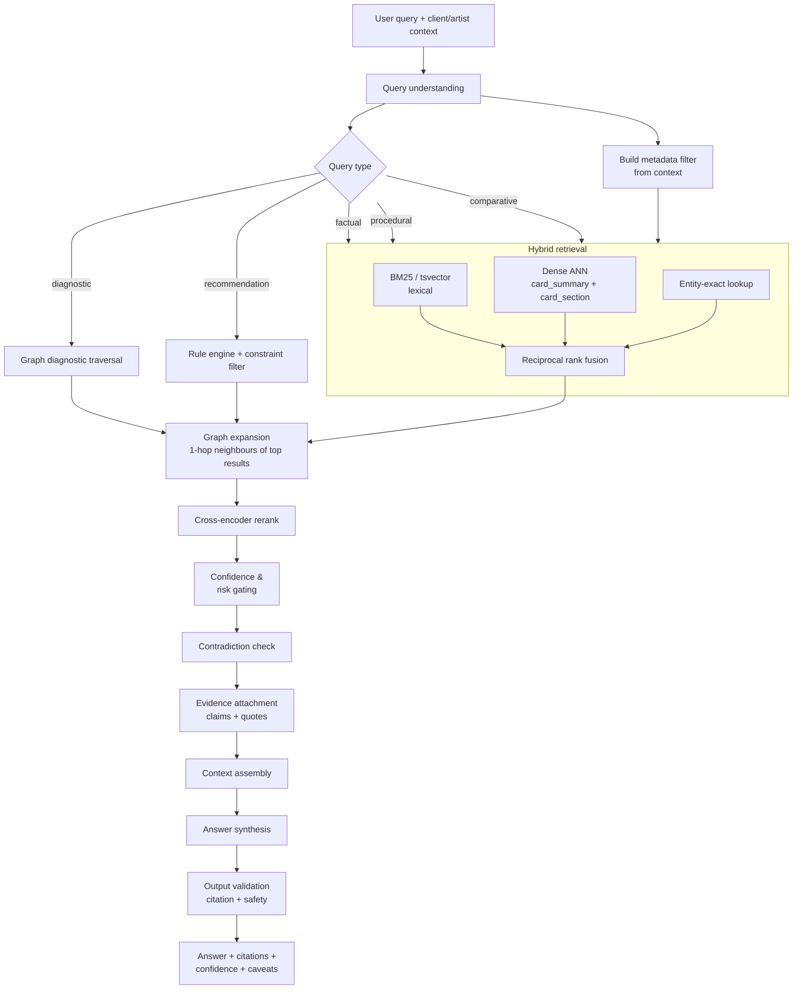

# 07 — RAG & Retrieval Architecture

## 1. Why not naive RAG

The default approach — chunk transcripts, embed, retrieve top-k, stuff into a prompt — fails
this domain specifically:

| Naive RAG behaviour | Consequence here |
| --- | --- |
| Retrieves whatever is most similar | Returns the most *repeated* claim, i.e. the folklore |
| No confidence signal | Anecdote and chemistry weighted equally |
| No contradiction awareness | Picks one side of a live professional dispute at random |
| Chunk-level attribution only | "Some transcript said this" is not attribution |
| No parametric reasoning | Cannot compute; can only quote |
| No context filtering | Gives humid-climate advice to an artist in Phoenix |
| Degrades as corpus grows | More transcripts = more near-duplicate chunks crowding the window |

LKE retrieves over **curated knowledge**, not raw text. Every retrieved item already carries
confidence, evidence tier, risk tier, applicability conditions and full provenance.

---

## 2. Index design — four collections

| Collection | Unit | Dim | Purpose | Approx count |
| --- | --- | --- | --- | --- |
| `card_summary` | title + definition + summary | 1024 | Concept-level retrieval; the default | 6,000 |
| `card_section` | each card section separately | 1024 | Precise passage retrieval ("the steps", "the mistakes") | 40,000 |
| `claim` | `normalized_statement` | 1024 | Evidence grounding, contradiction retrieval, corroboration | 250,000 |
| `quote` | `verbatim_quote` | 1024 | Educator-voice retrieval: "what did *she* actually say?" | 250,000 |

Separating claim and quote collections is not redundancy. The normalised statement is what
matches a user's question; the verbatim quote is what gets shown as evidence. Embedding the
verbatim text separately means "find where an educator says something like this in their own
words" is a first-class query — which powers both the AI Educator's citation behaviour and
the course generator's ability to pull authentic teaching language.

### 2.1 Metadata payload (filterable, on every vector)

```json
{
  "card_id": "kc_ADH_humidity-cure-window",
  "domain": "ADH",
  "primary_path": ["Adhesive Science", "Humidity & Temperature Response"],
  "knowledge_type": "parameter",
  "epistemic_status": "industry_consensus",
  "risk_tier": 1,
  "skill_level": "foundation",
  "audience": ["artist", "educator", "salon_owner"],
  "service_lifecycle": ["application"],
  "context_sensitivity": ["humidity", "temperature", "product_specific"],
  "confidence": 0.812,
  "confidence_band": "high",
  "independent_groups": 9,
  "has_parameters": true,
  "has_contradiction": false,
  "last_evidence_at": "2026-05-11",
  "status": "published",
  "creator_ids": ["crt_..."],
  "entity_ids": ["ent_env_relative-humidity", "ent_chem_cyanoacrylate"]
}
```

Filtering happens **inside** the vector store, not after retrieval. Post-filtering top-k
destroys recall: if 80% of results are filtered out, an effective k of 20 becomes 4.

---

## 3. Retrieval pipeline



### 3.1 Query understanding

Classifies into: `factual` · `diagnostic` · `procedural` · `recommendation` · `comparative` ·
`definitional` · `business` · `safety`. Extracts entities, parameters ("65% humidity",
"0.05 D curl", "day 5") and implicit context.

**Context injection is what makes this a product rather than a search box.** When LashOS
knows the artist's studio RH, region, skill level, and the client's skin type and lash health,
those become retrieval filters and ranking boosts automatically. The same question from two
artists should produce different correct answers.

### 3.2 Hybrid retrieval

Three retrievers, fused by reciprocal rank fusion (`k=60`):

```
score_rrf(d) = Σ_retrievers 1 / (60 + rank_r(d))
```

- **Lexical (BM25)** — non-negotiable in this domain. Exact match on "0.07", "CC curl",
  "blepharitis" and brand names is where dense retrieval is weakest and precision matters most.
- **Dense** — semantic paraphrase, the majority of natural questions.
- **Entity-exact** — direct lookup when the query names a known entity; guarantees the
  canonical card for that entity is always a candidate.

RRF rather than score normalisation: it is robust without tuning, which matters when the
corpus composition shifts during backfill.

### 3.3 Graph expansion

The step that distinguishes this from every other RAG system. For each top result, pull
1-hop neighbours along query-relevant predicates:

| Query type | Predicates expanded |
| --- | --- |
| diagnostic | `indicates`, `causes` (reverse), `differentiates_from` |
| procedural | `requires`, `precedes`, `part_of` |
| recommendation | `suitable_for`, `alternative_to`, `contraindicated_with` |
| factual | `affects`, `defined_by`, `measured_by` |
| safety | `contraindicated_with`, `presents_as`, `prevents` |

Expanded nodes enter reranking at a 0.7 weight multiplier — related but not directly matched.

This is how an answer about humidity also surfaces `contraindicated_with` and
`trade_off_with` edges the user did not ask about but needs.

### 3.4 Reranking

Cross-encoder over (query, card_section) pairs, top-50 → top-8. Then a final composite:

```
final = 0.55 · rerank_score
      + 0.20 · card.confidence
      + 0.15 · context_match(card.conditions, user_context)
      + 0.10 · recency_factor(card)
```

Confidence entering the *ranking* function, not just the display, is deliberate: a
lower-similarity but far better-evidenced card should usually win.

### 3.5 Gating

| Gate | Rule |
| --- | --- |
| Confidence floor | Per-feature minimum (Educator 0.55, Consultation 0.70, Retention 0.65, Safety 0.75) |
| Risk tier | Tier 3/4 → force citations, referral language, disclaimer; block if unreviewed |
| Status | `draft` and `deprecated` excluded from all product surfaces |
| Context conflict | Cards whose `conditions` are violated by known context are dropped, not merely down-ranked |
| Contradiction | If any retrieved card has an open contradiction, the opposing position is force-included |

The last rule is important and easy to miss: without it, retrieval returns the majority
position, the model writes a confident answer, and the disagreement the system worked hard to
detect never reaches the user.

---

## 4. Context assembly

Structured, not concatenated prose. The generator receives typed evidence:

```
## KNOWLEDGE (ranked)

[K1] Adhesive Humidity Cure Window
     confidence: 0.81 (high) · industry_consensus · risk_tier 1
     definition: ...
     mechanism: ...
     parameters:
       optimal_relative_humidity: 45–55 %RH  (ethyl cyanoacrylate, standard viscosity, 20–24 °C)
       brittle_bond_threshold: > 65 %RH
     conditions: standard-viscosity adhesive
     evidence: 47 claims · 9 independent groups · highest tier: manufacturer_spec
     sources: Jane Doe (YouTube 2024-03) · ... 
     ⚠ user context RH = 68% — EXCEEDS optimal range

[K2] ... 

## CONTRADICTIONS IN SCOPE
[C1] Refrigerated adhesive storage — unresolved, weights 0.55 / 0.45
     handling: present_both

## SUPPORTING QUOTES
[Q1] "If you're above sixty percent humidity your glue is curing before it even touches
      the lash." — Jane Doe, YouTube, 2024-03-14 @ 21:31  [clm_7d2e9f10b4a3]

## USER CONTEXT
studio_rh: 68 %RH · region: US-FL · client_skin: oily · artist_level: intermediate
symptom: outer-corner shedding at day 5
```

The `⚠` context-conflict annotation is generated deterministically by comparing card
parameters against user context before the model sees anything. The model does not have to
notice the mismatch — it is handed the finding.

---

## 5. Answer synthesis contract

Rules enforced on generation:

1. **Every factual assertion cites `[Kn]` or `[Qn]`.** Uncited assertions are stripped by the
   output validator.
2. **Confidence is expressed in language,** mapped from the band — no numbers in prose unless
   the user asks. `very_high` → "Established"; `moderate` → "Generally accepted, though…";
   `low` → "Some educators suggest…".
3. **Contradictions are surfaced, never silently resolved**, per `ai_handling`.
4. **Context conflicts lead the answer** when present. If the user's RH is out of range, that
   is the answer, not a footnote.
5. **Risk tier ≥ 3 forces referral framing** and forbids diagnostic phrasing.
6. **Unknown is a valid answer.** If nothing clears the confidence floor: say so, say what
   *is* known nearby, and log it as an evidence gap for acquisition.

Rule 6 is a product decision as much as a technical one. In a professional tool, "I don't
have good evidence on that" builds more trust than a confident guess — and the logged gap
directly feeds the content-acquisition roadmap.

---

## 6. Feature-specific configurations

| Feature | Primary collections | Graph use | Conf floor | Risk posture |
| --- | --- | --- | --- | --- |
| AI Lash Educator | card_summary, card_section, quote | prerequisite DAG | 0.55 | Cite for tier ≥ 2 |
| AI Consultation | card_summary, parameters | `suitable_for`, `contraindicated_with` | 0.70 | Tier 3 → refer |
| AI Retention Expert | card_section, claim, parameters | reverse causal | 0.65 | Cite always |
| AI Styling Assistant | card_summary, parameters | `applies_to` eye shape/lash trait | 0.60 | — |
| AI Product Recommender | entity attributes, parameters | constraint satisfaction | 0.60 | Disclose commercial bias |
| AI Troubleshooting | claim, card_section | diagnostic subgraph | 0.65 | Tier 3 → refer |
| AI Business Coach | card_summary, card_section | impact projection | 0.55 | — |
| AI Course Generator | card_section, quote | prerequisite DAG + community detection | 0.70 | Exclude contested |
| AI Certification | card_section, parameters | prerequisite DAG | **0.80** | Exclude contested entirely |

Certification runs at the highest floor and excludes contested knowledge outright — you cannot
examine someone on a question the industry has not settled.

---

## 7. Evaluation harness

Retrieval quality is measured continuously, not assessed once.

| Layer | Metric | Target |
| --- | --- | --- |
| Retrieval | Recall@20 on gold query set (200 queries) | ≥ 0.90 |
| Retrieval | nDCG@10 | ≥ 0.75 |
| Rerank | MRR of the correct primary card | ≥ 0.80 |
| Grounding | Citation precision (cited claim actually supports the sentence) | ≥ 0.97 |
| Grounding | Uncited-assertion rate | ≤ 0.02 |
| Safety | Tier-3 responses containing referral language | 1.00 |
| Safety | Diagnostic phrasing on tier-3 content | 0.00 |
| Contradiction | Contested queries where both positions appear | ≥ 0.95 |
| Context | Answers respecting user-context conflicts | ≥ 0.95 |
| Calibration | Expert agreement with stated confidence | ≥ 0.80 |
| Refusal | Correct "insufficient evidence" on the 40 out-of-corpus probe queries | ≥ 0.90 |

The gold set lives in `17-LashOS-Intelligence/Evaluation Sets` in the vault and in
`src/lashos_ke/evals/` as executable fixtures — so evaluation is version-controlled alongside
the prompts it grades, and every prompt change runs the suite before deploy.

---

## 8. Vector store selection

| Stage | Choice | Trigger to move |
| --- | --- | --- |
| v1 — < 500k vectors | **pgvector** (HNSW) in the same Postgres | Start here. No sync, transactional consistency with cards, one backup story |
| v2 — 500k–5M vectors, heavy filtering | **Qdrant** | Filtered-search latency > 200 ms p95, or filter selectivity hurting recall |
| v3 — multi-tenant, > 5M | Qdrant cluster or managed equivalent | Tenant isolation and horizontal scale |

pgvector is genuinely sufficient for the initial corpus and removes an entire class of
"the vector store disagrees with the database" bugs. Qdrant is the right second step because
its payload filtering is first-class rather than bolted on — which is exactly the pressure
this design puts on the store.

**Embedding model requirements:** ≥ 1024 dimensions, strong on technical/scientific text,
supports asymmetric query/document prefixes, and — critically — a stable version. Re-embedding
250k vectors is cheap; silently changing embedding semantics under a live index is not. Pin
the model version in `pipeline_version` and treat an upgrade as a migration.
