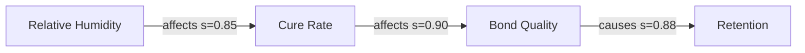

# 08 — Obsidian Vault Design

## 1. The vault's role

The vault is a **rendered, human-facing projection of the database** — it is not the system
of record. This single decision avoids the failure that kills most knowledge vaults: manual
edits and pipeline output diverging until neither can be trusted.

| Property | Implication |
| --- | --- |
| Generated | Destroyable and rebuildable from Postgres at any time |
| Deterministic | Same DB state → byte-identical vault → meaningful git diffs |
| Round-trip safe | Human override blocks are read back before regeneration |
| Link-stable | Merged cards leave alias stubs; links never break |

Its purpose is human thinking: browsing, graph exploration, spotting gaps, reviewing
contradictions, and drafting course material. Machines use the API.

---

## 2. Folder structure

```
vault/
├── 00-System/
│   ├── README.md                       # what this vault is, how it's generated
│   ├── Schema Reference.md
│   ├── Changelog.md                    # per-export diff summary
│   ├── Dashboard.md                    # Dataview health dashboard
│   ├── Coverage Map.md                 # domain coverage + evidence depth
│   └── Review Queue.md                 # open human-review tasks
├── 10-Knowledge/
│   ├── 01-Anatomy-Biology/
│   ├── 02-Lash-Health-Safety/
│   ├── 03-Natural-Lash-Assessment/
│   ├── 04-Styling-Design/
│   ├── 05-Lash-Mapping/
│   ├── 06-Retention-Science/
│   ├── 07-Adhesive-Science/
│   ├── 08-Application-Technique/
│   ├── 09-Products-Materials/
│   ├── 10-Adjacent-Services/
│   ├── 11-Consultation-Client-Experience/
│   ├── 12-Client-Psychology/
│   ├── 13-Business-Operations/
│   ├── 14-Marketing-Brand/
│   ├── 15-Education-Pedagogy/
│   ├── 16-Industry-Intelligence/
│   └── 17-LashOS-Intelligence/
├── 20-Entities/
│   ├── Brands/  Products/  Chemicals/  Tools/  Conditions/
│   ├── Styles/  Eye-Shapes/  Curls/  People/  Organizations/  Regions/
├── 30-Sources/                         # one note per transcript — metadata + claim index
├── 40-Maps/
│   ├── MOC - Retention.md
│   ├── MOC - Adhesive Science.md
│   ├── Causal Graph - Retention.canvas
│   └── Curriculum - Foundation Course.canvas
├── 50-Contradictions/
├── 60-Playbooks/                       # derived SOPs, diagnostic trees, decision matrices
├── 70-Research/
│   ├── Open Questions.md
│   ├── Evidence Gaps.md
│   └── Myth Registry.md
├── 90-Attachments/
└── _templates/                         # Templater templates for manual authoring
```

**Numeric prefixes** keep sort order stable and make the hierarchy legible in the file
explorer. **Raw transcripts are absent by design** — including them would flood graph view,
dominate search results, and destroy the signal-to-noise ratio the vault exists to provide.

---

## 3. File naming

```
10-Knowledge/07-Adhesive-Science/Adhesive Humidity Cure Window.md
20-Entities/Chemicals/Ethyl Cyanoacrylate.md
30-Sources/2024-03-14 Jane Doe - Why Your Retention Dies In Summer.md
50-Contradictions/Refrigerated Adhesive Storage.md
```

Human-readable titles, not IDs — Obsidian's wikilinks and search are title-driven, and a
vault full of `kc_ADH_humidity-cure-window.md` is unusable for the thinking work the vault
exists to support. The ID lives in frontmatter, and the export maintains an ID→path index
so links can be rewritten safely on retitle.

---

## 4. Knowledge card frontmatter

Frontmatter is the machine-readable contract; it must satisfy
[`schemas/yaml/frontmatter.spec.yaml`](../schemas/yaml/frontmatter.spec.yaml) and be flat
enough for Dataview to query.

```yaml
---
id: kc_ADH_humidity-cure-window
type: knowledge-card
title: Adhesive Humidity Cure Window
aliases: [glue humidity range, optimal humidity for adhesive]
version: 4
schema_version: 1.0.0

domain: ADH
domain_name: Adhesive Science
subcategory: Humidity & Temperature Response
secondary_domains: [RET, BIZ]

knowledge_type: parameter
epistemic_status: industry_consensus
risk_tier: 1
skill_level: foundation
audience: [artist, educator, salon_owner]
service_lifecycle: [application]
context_sensitivity: [humidity, temperature, product_specific]
actionability: decisional

confidence: 0.81
confidence_band: high
claim_count: 47
supporting_claims: 41
contradicting_claims: 6
independent_groups: 9
distinct_creators: 22
highest_evidence_tier: manufacturer_spec

has_parameters: true
has_contradictions: false
lashos_usable: true
ai_features: [retention_expert, troubleshooting_assistant, product_recommender]

status: published
created: 2026-06-02
updated: 2026-08-10
last_evidence: 2026-05-11
tags: [lke/card, domain/adhesive-science, type/parameter, conf/high, risk/1]
---
```

**Tags mirror key frontmatter fields** because Obsidian's tag pane and graph-view colouring
work on tags, while Dataview works on properties. Duplicating a handful of fields into the
`lke/…` namespace costs nothing and makes the vault navigable both ways.

---

## 5. Card body template

```markdown
> [!abstract] Definition
> One-sentence definition.

**Confidence** `=this.confidence` · **Evidence** 47 claims / 9 independent groups
· **Status** industry consensus · **Risk** tier 1

## Summary
2–4 sentences.

## Why It Works
The causal mechanism.

## Parameters
| Parameter | Value | Unit | Applies to | Conditions | Conf |
|---|---|---|---|---|---|
| Optimal RH | 45–55 | %RH | Ethyl cyanoacrylate | Standard viscosity, 20–24 °C | 0.86 |
| Brittle-bond threshold | > 65 | %RH | — | — | 0.71 |

## Practical Application
What the artist does with this.

## Implementation
1. **Measure studio RH** with a calibrated hygrometer at working height. ^step1
2. ...

## Common Mistakes
> [!warning] Reading humidity from a weather app
> **Why it happens:** convenience; unawareness of indoor microclimate.
> **Consequence:** adhesive mismatched to actual conditions.
> **Correction:** measure at the lash bed.

## Exceptions & Edge Cases
- Low-fume adhesives typically require higher RH and longer set times.
- Altitude above ~1500 m alters effective moisture availability.

## Contradicting Viewpoints
*(rendered only when contradictions exist)*
> [!question] Some educators assert 60–70% RH is optimal for fast-set adhesives
> **Weight** 0.32 · **Status** unresolved · See [[Refrigerated Adhesive Storage]]

## Evidence
| Tier | Count |
|---|---|
| Manufacturer spec | 4 |
| Practitioner test | 7 |
| Expert assertion | 29 |
| Anecdote | 7 |

### Key Quotes
> "If you're above sixty percent humidity your glue is curing before it even touches the lash."
> — [[2024-03-14 Jane Doe - Why Your Retention Dies In Summer|Jane Doe]], YouTube, 21:31

## Knowledge Graph


**Affects:** [[Adhesive Cure Kinetics]] · [[Bond Durability]]
**Requires:** [[Cyanoacrylate Chemistry]]
**Measured by:** [[Hygrometer]]
**Related:** [[Temperature Response]] · [[Environmental Factors in Retention]]

## LashOS Applications
> [!tip] Product integration
> - **Retention Expert** — primary environmental factor in diagnosis
> - **Troubleshooting** — root-cause branch for brittle bonds
> - **Product Recommender** — filter adhesives by humidity envelope
> - **Course module** — *Environment Control for Retention* (foundation, core)
> - **Retention model feature** — `studio_rh_deviation`

## Sources
| Creator | Platform | Date | Timestamp | Stance | Reliability |
|---|---|---|---|---|---|
| [[Jane Doe]] | YouTube | 2024-03-14 | [21:31](url&t=1291) | supports | 0.78 |

<!-- LKE:HUMAN-OVERRIDE:START -->
<!-- Notes here survive regeneration and sync back to the database. -->
<!-- LKE:HUMAN-OVERRIDE:END -->

---
*Generated by LashOS Knowledge Engine · card v4 · 2026-08-10*
```

Two details that matter: **block references** (`^step1`) let other notes and the course
generator transclude individual steps, and **deep-linked timestamps** in the source table
mean every claim is one click from the moment it was said. That is what makes attribution
real rather than nominal.

---

## 6. Source note template

Source notes carry metadata and an index into the claims — **not the transcript text.**

```markdown
---
id: src_yt_202403_a3f9c1d2
type: source
creator: crt_jane-doe-lashes
platform: youtube
published: 2024-03-14
duration_min: 57
reliability: 0.78
transcript_quality: good
commercial_context: sponsored
independence_group: ig_russian-volume-lineage
claims_extracted: 63
cards_contributed: 21
tags: [lke/source, platform/youtube, creator/jane-doe]
---

# Why Your Retention Dies In Summer
**[[Jane Doe]]** · YouTube · 2024-03-14 · [watch](url)

> [!info] Reliability 0.78
> Sponsored content — commercial-bias penalty applied. Domain expertise: ADH 0.85, RET 0.90.

## Cards Contributed
```dataview
TABLE confidence, domain FROM #lke/card WHERE contains(source_ids, this.id)
```

## Claims Extracted
| # | Timestamp | Claim | Type | Tier | Card |
|---|---|---|---|---|---|
| 1 | [21:31](url&t=1291) | RH > 60% causes premature cure | causal | expert_assertion | [[Adhesive Humidity Cure Window]] |
```

---

## 7. Contradiction note

```markdown
---
id: ctr_9a01ff34cd12
type: contradiction
conflict_type: factual
resolution_status: unresolved
ai_handling: present_both
risk_tier: 1
weight_a: 0.55
weight_b: 0.45
tags: [lke/contradiction, status/unresolved]
---

# Refrigerated Adhesive Storage

> [!question] Open industry disagreement

## Position A — extends shelf life  · weight 0.55 · 3 independent groups
Held by: [[Creator A]], [[Creator B]]
> "..." — quote with attribution

## Position B — introduces condensation  · weight 0.45 · 4 independent groups
Held by: [[Creator C]], [[Creator D]]
> "..."

## Resolution Hypothesis
May be handling-dependent: sealed with full acclimatisation vs improper thaw.

## Evidence Needed
Manufacturer specification survey · controlled shelf-life test.

## Affected Cards
[[Adhesive Storage Protocol]] · [[Adhesive Shelf Life]]
```

`50-Contradictions/` is, in practice, the most commercially interesting folder in the vault.
Each open contradiction is a question the industry has not answered — which makes it both a
research agenda and a content opportunity.

---

## 8. Dataview dashboards

`00-System/Dashboard.md`:

````markdown
## Corpus health
```dataview
TABLE length(rows) AS Cards, round(average(rows.confidence),2) AS "Mean conf"
FROM #lke/card GROUP BY domain_name
```

## Needs evidence — high risk, low confidence
```dataview
TABLE confidence, claim_count, independent_groups
FROM #lke/card WHERE risk_tier >= 2 AND confidence < 0.65
SORT confidence ASC
```

## Single-source cards (fragile knowledge)
```dataview
LIST FROM #lke/card WHERE independent_groups = 1 SORT domain ASC
```

## Open contradictions
```dataview
TABLE conflict_type, weight_a, weight_b
FROM #lke/contradiction WHERE resolution_status = "unresolved"
```

## Stale knowledge
```dataview
TABLE last_evidence, confidence FROM #lke/card
WHERE date(today) - date(last_evidence) > dur(2 years) SORT last_evidence ASC
```

## Not yet LashOS-usable
```dataview
TABLE confidence, risk_tier, status FROM #lke/card WHERE lashos_usable = false
```
````

These queries turn the vault into an operational instrument. "Single-source cards" and
"needs evidence" in particular drive the content-acquisition roadmap directly.

---

## 9. Graph view and canvases

**Graph view colour groups** (`.obsidian/graph.json`, generated):

| Query | Colour | Meaning |
| --- | --- | --- |
| `tag:#lke/card conf/very-high` | green | Solid knowledge |
| `tag:#lke/card conf/low` | amber | Thin evidence |
| `tag:#lke/contradiction` | red | Disputed |
| `tag:#lke/entity` | blue | Entities |
| `path:30-Sources` | grey | Sources |

Colouring by confidence rather than by folder makes the health of the knowledge base visible
at a glance — clusters of amber are exactly where acquisition effort should go next.

**Generated canvases** in `40-Maps/` render causal subgraphs and curriculum DAGs as `.canvas`
JSON. These are produced by the exporter from graph queries, giving a spatial view of the
retention causal chain or a course structure that no amount of linked prose conveys.

---

## 10. Export safety

The exporter is destructive to machine-owned regions, so it is defended:

1. **Pre-flight:** scan for `LKE:HUMAN-OVERRIDE` blocks → upsert into `cards.human_override_md`
2. Render into a staging directory
3. **Diff** staging against the live vault
4. **Halt** if deletions exceed the configured threshold (default 5% of files) and require
   explicit confirmation
5. Apply atomically; write a summary into `00-System/Changelog.md`
6. Rewrite links for merged cards; leave alias stubs at old paths

The vault is also a git repository, separate from the code repository. Every export is a
commit, so the entire history of the knowledge base is inspectable and any bad export is one
`git revert` away.
