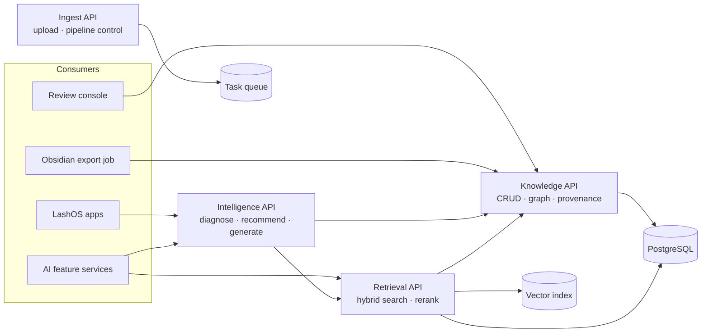

# 10 — API Architecture

## 1. Service boundaries

Four services, deployed independently, sharing one database. Not microservices for their own
sake — these are the four boundaries where scaling characteristics genuinely diverge.



| Service | Scaling driver | Latency budget |
| --- | --- | --- |
| Knowledge API | Read-heavy, cacheable | p95 < 100 ms |
| Retrieval API | Vector + rerank CPU | p95 < 400 ms |
| Intelligence API | LLM latency-bound | p95 < 4 s (streaming) |
| Ingest API | Throughput, not latency | async |

---

## 2. Conventions

- Base: `https://api.lashos.io/kb/v1`
- Auth: OAuth2 client credentials for services; scoped API keys for internal tooling.
  Scopes: `kb.read` `kb.write` `kb.review` `kb.ingest` `kb.admin`
- Every response carries `X-Request-Id`; every knowledge response carries
  `X-Knowledge-Version` (corpus snapshot ID) so answers are reproducible.
- Errors: RFC 9457 `application/problem+json`.
- Pagination: cursor-based (`?cursor=&limit=`). Never offset — the corpus mutates under
  pagination during backfill.
- **Every response containing knowledge includes `confidence`, `epistemic_status`,
  `risk_tier` and `sources`.** There is no endpoint that returns a naked assertion. This is a
  structural guarantee, not a convention: the response serialiser refuses to emit a knowledge
  object without them.

---

## 3. Knowledge API

```http
GET    /cards                       # filter: domain, status, risk_tier, min_confidence,
                                    #         knowledge_type, ai_feature, updated_since
GET    /cards/{id}                  # ?include=claims,relations,parameters,contradictions
GET    /cards/{id}/provenance       # full evidence chain to timestamps
GET    /cards/{id}/versions
GET    /cards/{id}/versions/{n}
PATCH  /cards/{id}                  # human override block, status, risk tier  [kb.review]
GET    /cards/{id}/claims           # ?stance=supports|contradicts

GET    /concepts/{id}
GET    /entities                    # ?type=&q=
GET    /entities/{id}
GET    /entities/{id}/cards

GET    /claims/{id}
GET    /sources                     # ?creator=&platform=&since=
GET    /sources/{id}
GET    /sources/{id}/claims
GET    /creators/{id}
GET    /creators/{id}/reliability   # component breakdown, auditable

GET    /contradictions              # ?status=unresolved&risk_tier_gte=2
POST   /contradictions/{id}/resolve # [kb.review]

GET    /parameters                  # ?name=&value=&unit=&entity=  ← the recommender's workhorse
GET    /taxonomy                    # full tree + facets, ETag-cached
GET    /taxonomy/{domain}
```

**Provenance response** — the shape that makes attribution real:

```json
{
  "card_id": "kc_ADH_humidity-cure-window",
  "confidence": 0.812,
  "evidence_chain": [{
    "claim_id": "clm_7d2e9f10b4a3",
    "stance": "supports",
    "evidence_tier": "expert_assertion",
    "verbatim_quote": "If you're above sixty percent humidity your glue is curing before it even touches the lash.",
    "normalized_statement": "Relative humidity above 60% causes cyanoacrylate to cure prematurely.",
    "timestamp": {"start": 1291.0, "end": 1305.4},
    "source": {
      "id": "src_yt_202403_a3f9c1d2",
      "title": "Why Your Retention Dies In Summer",
      "platform": "youtube",
      "published_at": "2024-03-14",
      "deep_link": "https://youtube.com/watch?v=...&t=1291",
      "reliability_score": 0.78,
      "commercial_context": "sponsored"
    },
    "creator": {"id": "crt_jane-doe-lashes", "display_name": "Jane Doe",
                "domain_expertise": {"ADH": 0.85}}
  }],
  "evidence_summary": {
    "claim_count": 47, "independent_groups": 9, "distinct_creators": 22,
    "tier_ledger": {"manufacturer_spec": 4, "controlled_test": 7,
                    "expert_assertion": 29, "anecdote": 7}
  }
}
```

---

## 4. Retrieval API

```http
POST /search
POST /search/claims          # evidence-level retrieval
POST /search/quotes          # educator-voice retrieval
POST /graph/traverse
POST /graph/diagnose
POST /graph/path
```

```http
POST /search
{
  "query": "why is retention bad in summer",
  "mode": "hybrid",
  "filters": {
    "domain": ["RET", "ADH"],
    "min_confidence": 0.6,
    "max_risk_tier": 2,
    "knowledge_type": ["mechanism", "parameter", "diagnostic"]
  },
  "context": {
    "studio_rh": 68, "region": "US-FL",
    "client_skin_type": "oily", "artist_skill_level": "intermediate"
  },
  "expand_graph": true,
  "limit": 10
}
```

Response items carry a `context_flags` array — deterministically computed, not model-generated:

```json
{
  "results": [{
    "card_id": "kc_ADH_humidity-cure-window",
    "title": "Adhesive Humidity Cure Window",
    "score": 0.91,
    "confidence": 0.812,
    "epistemic_status": "industry_consensus",
    "risk_tier": 1,
    "matched_section": "mechanism",
    "context_flags": [
      {"type": "parameter_conflict",
       "detail": "studio_rh 68 %RH exceeds optimal_relative_humidity 45–55 %RH",
       "severity": "high"}
    ],
    "graph_expansion": [
      {"card_id": "kc_ADH_flash-cure", "via": "causes", "strength": 0.85}
    ],
    "sources": [{"creator": "Jane Doe", "platform": "youtube",
                 "published_at": "2024-03-14", "deep_link": "..."}]
  }],
  "contradictions_in_scope": [],
  "knowledge_version": "kv_2026_08_10_a1"
}
```

`context_flags` is the API's most product-relevant feature: the caller is told *the user's
situation violates this card's assumptions* before any language model sees the data.

```http
POST /graph/diagnose
{
  "symptom": "premature_shedding",
  "observations": {"onset_days": 5, "zone": "outer_corner", "pattern": "clean_base"},
  "context": {"studio_rh": 68, "client_skin_type": "oily", "adhesive_id": "ent_prod_..."},
  "max_depth": 4
}
```

```json
{
  "ranked_causes": [{
    "cause_card_id": "kc_ADH_humidity-cure-window",
    "label": "Excess studio humidity → flash curing",
    "path_confidence": 0.62,
    "context_match": 0.95,
    "score": 0.589,
    "causal_path": [
      {"from": "relative_humidity", "predicate": "causes", "to": "flash_cure", "strength": 0.85},
      {"from": "flash_cure", "predicate": "causes", "to": "brittle_bond", "strength": 0.80},
      {"from": "brittle_bond", "predicate": "causes", "to": "premature_shedding", "strength": 0.88}
    ],
    "discriminating_question": "Does the shed extension have adhesive still attached to it?",
    "recommended_actions": ["Measure RH at the lash bed", "Switch to a slower-set adhesive above 60% RH"]
  }],
  "ruled_out": [{"cause": "isolation_failure", "reason": "clean_base pattern inconsistent"}]
}
```

`discriminating_question` is what turns a ranked list into an actual diagnostic conversation —
the assistant asks the one question that best separates the top hypotheses.

---

## 5. Intelligence API

The product-facing layer. Each endpoint is a configured composition of retrieval, graph and
generation with feature-specific gating from [07 §6](07-rag-architecture.md).

```http
POST /assist/educator          # explain, teach, answer
POST /assist/consultation      # client-facing recommendation with contraindication screening
POST /assist/retention         # retention diagnosis and prediction
POST /assist/styling           # style + mapping recommendation
POST /assist/products          # product recommendation with disclosed bias
POST /assist/troubleshoot      # fault diagnosis
POST /assist/business          # business coaching
POST /generate/course          # curriculum generation from the prerequisite DAG
POST /generate/assessment      # certification items with answer keys
```

Common response envelope — identical across every assist endpoint:

```json
{
  "answer": "...",
  "confidence": "high",
  "citations": [
    {"marker": "[K1]", "card_id": "kc_...", "title": "...", "confidence": 0.812,
     "quote": "...", "creator": "Jane Doe", "deep_link": "..."}
  ],
  "caveats": [
    {"type": "context_conflict",
     "message": "Your studio humidity (68%) is above the range this guidance assumes."}
  ],
  "contradictions": [
    {"topic": "Refrigerated adhesive storage", "handling": "present_both",
     "positions": [{"claim": "...", "weight": 0.55}, {"claim": "...", "weight": 0.45}]}
  ],
  "safety": {"risk_tier": 1, "referral_recommended": false, "disclaimer": null},
  "knowledge_version": "kv_2026_08_10_a1",
  "evidence_gaps": []
}
```

Every assist response is uniform, so a client that renders citations, caveats and
contradictions once renders them for all nine features. `evidence_gaps` returns non-empty
when the question could not be answered from the corpus — and each entry is logged as an
acquisition target.

**Course generation** returns a structure, not prose:

```json
{
  "course": {
    "title": "Foundation Certificate in Classic Lash Extensions",
    "level": "foundation", "estimated_hours": 24,
    "modules": [{
      "sequence": 1, "title": "Eye and Lash Anatomy",
      "learning_objectives": ["..."],
      "source_cards": ["kc_ANA_...", "kc_ANA_..."],
      "prerequisites": [],
      "assessment_items": 8,
      "min_card_confidence": 0.74,
      "contested_topics_excluded": ["kc_ADH_storage-refrigeration"]
    }]
  },
  "coverage": {"cards_used": 84, "domains": ["ANA","HLT","APP"], "mean_confidence": 0.79},
  "gaps": [{"topic": "Occupational sensitisation", "reason": "insufficient evidence",
            "cards_available": 1}]
}
```

`contested_topics_excluded` and `gaps` make the generated curriculum honest about its own
limits — which is what a certification body will ask about first.

---

## 6. Ingest API

```http
POST   /ingest/sources               # register + upload transcript  [kb.ingest]
POST   /ingest/sources/batch         # bulk manifest
GET    /ingest/sources/{id}/status
POST   /ingest/sources/{id}/reprocess?from_stage=S2
GET    /ingest/runs                  # pipeline observability
POST   /ingest/runs/{id}/cancel
GET    /ingest/metrics               # per-stage health (doc 03 §5)
```

```http
POST /ingest/sources
{
  "title": "...", "creator_id": "crt_...", "platform": "youtube",
  "url": "...", "published_at": "2024-03-14",
  "commercial_context": "sponsored",
  "transcript": {"format": "vtt", "content_url": "s3://..."}
}
→ 202 { "source_id": "...", "status": "queued", "duplicate_of": null }
```

`duplicate_of` populated → the content hash already exists; the request registers an
additional distribution rather than a new source.

---

## 7. Review API

Backs the human review console, which is the only UI in the system with write authority over
knowledge.

```http
GET   /review/tasks                  # ?state=open&priority=0&type=contradiction
POST  /review/tasks/{id}/claim
POST  /review/tasks/{id}/resolve
GET   /review/tasks/{id}/context     # everything needed to decide, in one call
POST  /review/decisions              # binding constraint, replayed on future runs
GET   /review/stats
```

`/review/tasks/{id}/context` returns both positions, verbatim quotes with deep links, creator
reliability breakdowns, affected cards and the model's reasoning — in a single response. A
reviewer making 90-second decisions cannot afford five round-trips per task, and this endpoint
exists specifically to keep the ~60 hours of expert review time in doc 05 §8 from becoming 200.

---

## 8. Caching, versioning, safety

**Caching.** Knowledge changes in batches, not continuously. `GET /cards/{id}` and `/taxonomy`
are ETag-cached with 1-hour TTL, invalidated by card version bump. Retrieval results cache on
`(query_hash, filter_hash, context_hash, knowledge_version)` for 15 minutes.

**Knowledge versioning.** Every corpus batch produces a `knowledge_version`. Callers may pin it
(`?knowledge_version=kv_2026_08_10_a1`) to reproduce an answer exactly — required for
certification and for any dispute about what the system said and when.

**API evolution.** URL-versioned major (`/v1`). Additive changes are non-breaking by contract;
consumers must ignore unknown fields. Deprecation: `Sunset` header + 6 months.

**Safety enforcement at the API boundary.** The response serialiser — not the prompt — enforces:

- No knowledge object without `confidence`, `risk_tier`, `sources`
- Risk tier ≥ 3 without `reviewed_at` → excluded from all `/assist` responses
- Risk tier ≥ 3 responses without referral language → **500, not a degraded answer**
- Contradictions in scope always attached, never suppressible by the caller

That last group is deliberately un-bypassable. A future feature team under deadline pressure
must not be able to turn safety framing off with a query parameter — if the framing cannot be
generated, the request fails.

**Rate limits.** `kb.read` 1000/min · `/assist` 60/min per tenant · `kb.ingest` 100/min.
