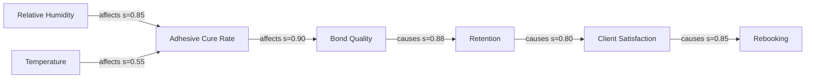

> [!abstract] Definition
> The relative-humidity band within which cyanoacrylate lash adhesive polymerises at a rate
> that produces optimal bond strength.

**Confidence** 0.812 (high) · **Evidence** 47 claims / 9 independent groups
· **Status** industry consensus · **Risk** tier 1

## Summary
Lash adhesive cures through anionic polymerisation initiated by ambient moisture, which makes
relative humidity the dominant environmental variable in bond formation. Standard-viscosity
cyanoacrylate adhesives perform best between roughly 45% and 55% RH. Below that range curing
slows and bonds may remain under-polymerised; above roughly 65% the adhesive begins to cure
before the extension is seated, producing a bond that looks correct but is mechanically
brittle. Manufacturer-specified ranges vary considerably, so product documentation takes
precedence over any general figure.

## Why It Works
Cyanoacrylate monomers polymerise when they encounter hydroxide ions supplied by water in the
air. Cure rate is therefore approximately proportional to available atmospheric moisture. At
optimal humidity the adhesive stays workable long enough for the extension to be placed and
seated, then completes its surface cure quickly enough to resist displacement. As humidity
rises, the reaction front reaches the adhesive surface before placement is complete — the
outer layer sets while the interior is still liquid, producing a shell rather than a
continuous bond. This "flash cure" bond has a much smaller effective contact area than it
appears to, which is why it fails under ordinary shear loading days later rather than
immediately.

## Parameters
| Parameter | Value | Unit | Applies to | Conditions | Conf |
|---|---|---|---|---|---|
| Optimal relative humidity | 45–55 | %RH | [[Ethyl Cyanoacrylate]] | Standard viscosity, 20–24 °C | 0.86 |
| Brittle-bond threshold | > 65 | %RH | [[Ethyl Cyanoacrylate]] | Standard viscosity | 0.71 |
| Slow-cure threshold | < 35 | %RH | [[Ethyl Cyanoacrylate]] | Standard viscosity | 0.68 |
| Optimal relative humidity (fast-set) | 55–65 | %RH | [[Ethyl Cyanoacrylate]] | Low viscosity / fast-set | 0.64 |

> [!note] Optimal relative humidity: manufacturer-specified ranges vary from 35% to 70% across
> products. Always defer to the product's technical documentation over any general figure.

## Practical Application
Measure the humidity in the room where you work, at the height you work — not outdoors and not
from a phone weather app. Select an adhesive whose specified humidity envelope contains your
measured value, or bring the room into the adhesive's range with a humidifier or dehumidifier.
When retention complaints appear across multiple unrelated clients at once, check the room
before re-examining your technique: environment is the variable most likely to have changed
for everyone simultaneously.

## Implementation
1. **Measure studio RH with a calibrated hygrometer at working height.** Place it beside the lash bed, not on a wall across the room. ^step1
2. **Record the reading at the start and end of each service.** Humidity moves through the day, and a single morning reading will mislead you. ^step2
3. **Compare against your adhesive's specified envelope.** Use the product's technical documentation, not a general rule. ^step3
4. **Correct the room, or change the adhesive.** A dehumidifier is usually cheaper and more reliable than switching to an adhesive you have not trained on. ^step4
5. **Re-measure after any HVAC, seasonal, or room change.** ^step5

**Requires:** Calibrated hygrometer · Ability to control studio humidity

## Common Mistakes

> [!warning] Reading humidity from a phone weather app
> **Why it happens:** Convenience, and unawareness that indoor microclimate differs sharply from outdoor conditions.
> **Consequence:** Adhesive selected for conditions that do not exist in the room; retention problems misattributed to technique.
> **Correction:** Measure at the lash bed with a calibrated hygrometer.

> [!warning] Assuming one humidity figure applies to every adhesive
> **Why it happens:** The 45–55% figure is repeated constantly without its scope.
> **Consequence:** Fast-set and low-fume adhesives are run outside their intended envelope.
> **Correction:** Treat 45–55% as a default for standard-viscosity adhesive only; check the product spec.

> [!warning] Chasing humidity while ignoring temperature
> **Why it happens:** Humidity gets far more coverage in industry education.
> **Consequence:** A room at correct RH but 16 °C still cures slowly; the artist concludes the adhesive is faulty.
> **Correction:** Control both. See [[Adhesive Temperature Response]].

## Exceptions & Edge Cases
- **Low-fume and sensitive adhesives** — typically require higher RH and longer set times than standard formulations.
- **Fast-set / low-viscosity adhesives** — several manufacturers specify 55–65% RH.
- Altitude above roughly 1500 m alters effective moisture availability at a given measured RH.
- Nano-misting and shock-curing interventions change the local humidity at the bond and are treated separately — see [[Curing Interventions]].

## Evidence
| Tier | Count |
|---|---|
| Manufacturer spec | 4 |
| Controlled test | 7 |
| Expert assertion | 29 |
| Anecdote | 7 |

### Key Quotes

> "If you're above sixty percent humidity your glue is curing before it even touches the lash, and that's why your bonds are brittle."
> — [[2024-03-14 Jane Doe - Why Your Retention Dies In Summer|Jane Doe]], YouTube, 2024-03-14 @ 21:31

> "We tested the same adhesive at forty, fifty and sixty-five percent over three months and the difference in week-three retention was almost twenty points."
> — [[2025-09-02 Studio Collective - Adhesive Testing Panel|Marta Reyes]], Panel, 2025-09-02 @ 14:07

## Knowledge Graph

**Affects:** [[Adhesive Cure Kinetics]] · [[Bond Durability]] · [[Retention Rate]]
**Requires:** [[Cyanoacrylate Chemistry]]
**Measured by:** [[Hygrometer]]
**Trade-off with:** [[Viscosity and Dry Time]]
**Related:** [[Adhesive Temperature Response]] · [[Environmental Factors in Retention]] · [[Studio Environment Control]]

## LashOS Applications
> [!tip] Product integration
> - **Retention expert** — primary environmental factor in retention diagnosis
> - **Troubleshooting assistant** — root-cause branch for brittle-bond and premature-shed symptoms
> - **Product recommender** — filters adhesives by humidity envelope against measured studio RH
> - **Course module** — *Environment Control for Retention* (foundation, core concept)
> - **Retention model** — feature `studio_rh_deviation` = |measured_rh − adhesive_optimal_midpoint|
> - **Business intelligence** — justifies humidity-control capex; model against retention-driven rebook lift

## Sources
| Creator | Platform | Date | Timestamp | Stance | Reliability |
|---|---|---|---|---|---|
| [[Jane Doe]] | YouTube | 2024-03-14 | [21:31](https://youtube.com/watch?v=EXAMPLE&t=1291) | supports | 0.78 |
| [[Marta Reyes]] | Panel | 2025-09-02 | [14:07](https://example.com/panel&t=847) | supports | 0.86 |
| [[Adhesive Co. TDS]] | Article | 2025-01-10 | — | qualifies | 0.85 |
| *…19 further creators* | | | | | |

<!-- LKE:HUMAN-OVERRIDE:START -->
<!-- Notes added here survive regeneration and sync back to the database. -->
<!-- LKE:HUMAN-OVERRIDE:END -->

---
*Generated by LashOS Knowledge Engine · card v4 · 2026-08-10 · knowledge version kv_2026_08_10_a1*
